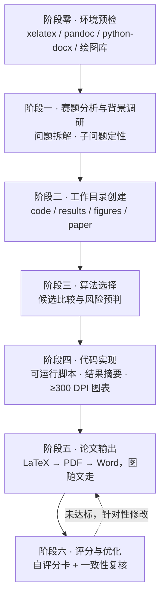

<h1 align="center">数学建模竞赛技能集</h1>

---

<p align="center"><b>mathmodel-kit · 开放的数模工具箱 · Open Modeling Toolbox</b></p>

<p align="center">
  数模竞赛的确定性工具箱：把「赛题分析 → 模型构建 → 算法实现 → 出版级图表 → 论文成稿与评分」<br>
  做成可按契约调用的技能与机器可读数据——<b>给参赛者，也给需要规范配图、排版与交付核查的研究者</b>。
</p>

<p align="center">
  <a href="https://github.com/Escap1ng/mathmodel-kit/actions/workflows/ci.yml"></a>
  <a href="https://github.com/Escap1ng/mathmodel-kit/actions/workflows/paper.yml"></a>
  
  
  
  
  <a href="CONTRIBUTING.md"></a>
</p>

<p align="center">
  <b>简体中文</b> &nbsp;·&nbsp; <a href="README_EN.md">English</a>
</p>

---

> **机械正确性交给技能，建模判断留给人。**
> 数据可复现、图表不裁切不重叠、论文数字可追溯到脚本产物、格式过自检清单——由技能保证；方法选型、结果解释与创新点表述仍由使用者决定。

**目录**：[快速开始](#快速开始) · [这是什么](#这是什么) · [为什么用它](#为什么用它) · [开放设计](#开放设计) · [效果预览](#效果预览) · [出图风格与主题](#出图风格与主题) · [工作流与质量门禁](#工作流与质量门禁) · [文档地图](#文档地图) · [仓库结构](#仓库结构) · [依赖](#依赖) · [常见问题](#常见问题) · [扩展与贡献](#扩展与贡献) · [路线图](#路线图) · [定位与合规声明](#定位与合规声明) · [致谢](#致谢)

## 快速开始

四步跑通，每步都能单独用——四个技能各自自包含，复制哪一个，哪一个就能独立工作。

```bash
# 1. 装技能：复制进宿主的技能目录即可，不需要安装任何框架（示例为 Claude Code）
cp -r skills/mathmodel-figure ~/.claude/skills/
# 之后在对话里直接说需求，如「用云雨图对比三组实验的耗时分布」「把这张参考图重画成技术路线图」

# 2. 数据图表：产物落 绘图复刻/outputs/（300 DPI PNG + 矢量 PDF + SVG）
cd skills/mathmodel-figure
python3 code/tools/render_template.py --list                     # 查看 20 个模板 id
python3 code/tools/render_template.py paired-raincloud           # 支持 id / 英文别名 / 中文图题片段
python3 code/tools/render_template.py 模块占比环形图               # 中文图题也能匹配
python3 code/tools/render_template.py --list-themes              # 配色主题可整体替换

# 3. 学术示意图：JSON 驱动，改内容不动几何
cd ../mathmodel-diagram
python3 code/tools/render_template.py roadmap-5band content.json -o out.png   # PNG 300dpi + 同名矢量 PDF
python3 code/tools/render_template.py roadmap-5band content.json --check      # 只做容量校验，不写文件
python3 code/tools/validate_content.py roadmap-5band content.json             # 按内容契约校验
```

```bash
# 4. 论文输出：填骨架 → 清源文件 → 编译 → 转 Word → 版式微调 → 交付前门禁
cd skills/mathmodel-paper && cp templates/paper.tex paper/
python3 code/strip_invisible.py --clean paper/paper.tex          # 编译前先清掉零宽/不可见字符
cd paper && xelatex -interaction=nonstopmode paper.tex && xelatex -interaction=nonstopmode paper.tex
pandoc paper.tex -o paper.docx                                   # 公式自动转 OMML 原生格式
cd .. && python3 code/word_postprocess.py paper/paper.docx       # 仅调版式，不重建内容
python3 code/strip_invisible.py --clean paper/paper.pdf paper/paper.docx   # 交付门禁：清理 + 复检须退出 0
```

模板不匹配时按 [`nature-standard.md`](skills/mathmodel-figure/docs/guides/nature-standard.md) 现绘（仍 `from plot_style import ...`）；
摘要写法与检查项见 [`abstract-template.md`](skills/mathmodel-paper/templates/abstract-template.md)。

## 这是什么

`mathmodel-kit` 是一个**开放的数模工具箱**：四个可独立使用、也可由主技能串成闭环的 agent 技能，
外加一套**机器可读的模板注册表与内容契约**——能力可以被枚举、被校验、被第三方程序消费，而不只是一堆提示词。

| 技能 | 职责 | 入口 | 产物 |
|---|---|---|---|
| [`math-modeling-helper`](skills/math-modeling-helper/SKILL.md) | **主技能**：按阶段零至阶段六编排全程（赛题分析 → 模型构建 → 算法实现 → 论文输出 → 评分优化） | 提交赛题或建模需求即触发 | 工作目录骨架、代码与结果、论文与评分报告 |
| [`mathmodel-figure`](skills/mathmodel-figure/SKILL.md) | **数据图表**：20 个 matplotlib 模板 + 模板库外的 Nature 出图标准 | `python3 code/tools/render_template.py <模板id>` | 300 DPI PNG + 矢量 PDF + SVG + 可改脚本 |
| [`mathmodel-diagram`](skills/mathmodel-diagram/SKILL.md) | **学术示意图**：5 个 JSON 驱动版式模板，另支持从零手绘与照参考图高保真复刻 | `python3 code/tools/render_template.py <模板id> content.json` | 300 DPI PNG + 矢量 PDF + content JSON |
| [`mathmodel-paper`](skills/mathmodel-paper/SKILL.md) | **论文输出**：LaTeX 骨架 → PDF → Word，含竞赛版式微调与零宽字符清理 | `xelatex` + `word_postprocess.py` + `strip_invisible.py` | 合规 `.pdf` 与 `.docx`（无不可见字符）、摘要模板 |

## 为什么用它

| 特性 | 说明 | 可验证的证据 |
|---|---|---|
| **不依赖模板库** | 图型由数据结构与要论证的结论决定；模板是加速器，不是边界 | 模板不匹配时按 [`nature-standard.md`](skills/mathmodel-figure/docs/guides/nature-standard.md) 现绘，与模板图共用同一套样式常量，混排看不出风格差 |
| **确定性与可复现** | 模板自带种子化模拟数据，示意图由 content JSON 驱动，任何产物都能重渲与二次修改 | `--list` 逐个渲染即得同名 PNG/PDF/SVG；示意图 `--check` 只校验不写文件 |
| **机器化质量门禁** | 不靠肉眼兜底：字数超框即非零退出，注册表与文档一致性由 CI 强制 | 见[工作流与质量门禁](#工作流与质量门禁)的五道门禁 |
| **配色可替换** | 配色是数据不是代码：声明在主题文件里，可整体换掉 | 换 `themes/*.theme.json` 或工作区 `scripts/theme.json`，共用样式模块的 9 个模板与自绘图一并跟随 |
| **反造假约束** | 禁止编造文献与数据；模拟数据不得声称复现真实结果；论文数字须追溯到脚本产物 | 主技能规范与自检清单中的强制条目 |

## 开放设计

「开放」不是姿态，而是可验证的属性。四个维度各有落地物，不靠人工同步的清单，也不靠口头约定：

| 维度 | 开放了什么 | 落地物 |
|---|---|---|
| **契约开放** | 模板清单、字段结构、取值约束、主题结构全部机器可读 | `manifest.json`、`code/templates/schema/*.schema.json`、`themes/theme.schema.json`（JSON Schema Draft 2020-12） |
| **接口开放** | 能力可枚举、可校验、可被其他程序编排 | 统一 CLI + 统一退出码语义：`0` 成功 / `1` 校验或渲染失败 / `2` 用法或环境错误 |
| **协作开放** | 第三方可增模板、改文档、报缺陷，且只需改两处 | 注册表登记一行 + 索引文档一行，其余一致性由 CI 自动校验 |
| **许可开放** | 可商用、可二次分发 | [Apache-2.0](LICENSE)，贡献即同意以同一许可发布 |

```bash
python3 code/tools/render_template.py --list --json                   # 输出注册表，供程序消费
python3 code/tools/render_template.py <模板id> content.json --check    # 机器可判定的渲染自检
python3 code/tools/validate_content.py <模板id> content.json           # 按 JSON Schema 校验内容契约
python3 code/tools/validate_theme.py <主题文件>                         # 校验自定义配色主题
```

接口承诺分三级：**Stable**（CLI 参数与退出码、注册表字段与主题契约字段、`schema_version` 语义、产物格式与路径）、
**Experimental**（`--lang` 文案、`--json` 字段顺序、错误信息措辞）、**Internal**（脚本内几何常量与基元签名）。
主题的**字段结构**属 Stable，**具体色值**属内容。

### 未来会更开放

把「还没做」写出来，是为了让依赖可预期：

| 时间 | 更开放在哪 | 状态 |
|---|---|---|
| **现在** | 契约 / 接口 / 协作 / 许可四项已落地；配色主题覆盖共用样式模块的 9 个图表模板与自绘图 | 已交付 |
| **Phase 2** | 主题控制扩展到全部 25 个模板（消除配色双轨）；多宿主安装说明；登记进社区索引，便于第三方发现与引用 | 规划中 |
| **Phase 3** | 可安装的命名空间包与面向第三方程序的稳定 Python API，让本项目能被**嵌入别人的流程**，而不只是被复制 | 以真实需求为触发条件 |

每条都写进[白皮书](docs/upgrade-plan.md)并附**触发条件**，不做没有说明的承诺；破坏性变更一律记入 [CHANGELOG.md](CHANGELOG.md)。

## 效果预览

20 个数据图表模板的 6 类代表：**缩略图可点击看原图**，每张下方标出模板 id，照此即可复现——
`python3 code/tools/render_template.py <模板id>`，产物落 `绘图复刻/outputs/`。全 20 张见
[`figure-catalog.md`](skills/mathmodel-figure/docs/templates/figure-catalog.md)。

| 对比 | 分布 | 相关性 |
|---|---|---|
| <a href="skills/mathmodel-figure/examples/previews/grouped_bar_replica.png"></a><br>`grouped-bar` 分组柱状图<br><sub>多方案指标对比 · 增益标注</sub> | <a href="skills/mathmodel-figure/examples/previews/paired_raincloud_replica.png"></a><br>`paired-raincloud` 配对云雨图<br><sub>分布形态 + 配对差异一图看完</sub> | <a href="skills/mathmodel-figure/examples/previews/heatmap_annotated_replica.png"></a><br>`heatmap-annotated` 相关热力图<br><sub>数值标注 + 上三角遮罩</sub> |

| 评价 | 权衡 | 网络构成 |
|---|---|---|
| <a href="skills/mathmodel-figure/examples/previews/taylor_diagram_replica.png"></a><br>`taylor-diagram` 多模型泰勒图<br><sub>标准差 · 相关系数 · 均方根误差同图</sub> | <a href="skills/mathmodel-figure/examples/previews/pareto_front_replica.png"></a><br>`pareto-front` Pareto 前沿<br><sub>非支配解集 · 拐点与理想点</sub> | <a href="skills/mathmodel-figure/examples/previews/nature_chord_diagram_replica.png"></a><br>`nature-chord-diagram` 和弦图<br><sub>流向与流量占比</sub> |

预览图由模板渲染器直接导出，改样式后重新渲染即可覆盖，不会有「预览与代码不一致」的问题。

## 出图风格与主题

数据图表的简单图型**默认**采用 Nature 版式——小字无衬线、细轴线、去冗余图例，颜色只承担四种职责，灰度打印仍可辨。
这是默认值而非硬性规定：配色由主题文件声明，可整体替换。

| 职责 | 取值 | 规则 |
|---|---|---|
| 身份 |  主角蓝，次系列橙/紫/青/珊红 | 同一方法在全文每张图里同色 |
| 基准 |  中灰 | 对照、均值、参考线永远是灰 |
| 方向 |   | 只标有正负的增量，并带 `↑/↓` 以过灰度打印 |
| 层级 | 同族明度阶梯（深 → 浅） | 主证据深、支持信息浅，不靠加色相区分主次 |

```bash
python3 code/tools/render_template.py grouped-bar --theme nature    # 默认主题，可省略
python3 code/tools/render_template.py grouped-bar --theme ./my.theme.json
```

渲染时主题写入工作区 `scripts/theme.json`，因此**工作区自包含**（脚本连同主题一起交付，任何人重跑都得到同一套颜色），
**改这份副本即可覆盖配色**，不必动仓库里的模板。当前覆盖共用 `plot_style.py` 的 9 个模板与按同一模块自绘的图；
其余 11 个模板与 5 个示意图的配色写在各自脚本头部（仍可在工作区副本里改），已列入 [Phase 2](#未来会更开放)。

换主题可以换色值，但不能让颜色丢掉上面四种语义，否则图的读法就变了。条文见
[`visualization-rules.md`](skills/mathmodel-figure/docs/guides/visualization-rules.md)，主题怎么写见
[`themes/README.md`](skills/mathmodel-figure/themes/README.md)。

## 工作流与质量门禁



机器能判定的都不靠肉眼兜底：

| 门禁 | 触发点 | 行为 |
|---|---|---|
| 中文字宽校验 | 示意图每次渲染前，逐槽量宽 | 超框报出具体槽位与预算，并以非零码退出 |
| 内容契约校验 | 提交或复用 content JSON 时 | 不符合 JSON Schema 即失败（`--all` 可批量校验内置示例） |
| 注册表一致性 | 每次 push / PR | 登记表 ↔ 文件系统 ↔ 索引文档 ↔ 版本号 ↔ README 徽章 必须一致 |
| 零宽字符清理 | 论文交付前 | PDF 与 Word 均须清理并复检，退出码为 0 才可交付 |
| 自评分卡 | 阶段六 | 百分制五维评分，未达标针对性修改后重评 |

## 文档地图

README 讲「是什么、怎么用」，细节在下面这些文档里——按需取用，不必从头读完：

| 想做什么 | 看这份 |
|---|---|
| 改图、换配色、加模板 | [`mathmodel-figure/SKILL.md`](skills/mathmodel-figure/SKILL.md) · [`themes/README.md`](skills/mathmodel-figure/themes/README.md) |
| 写论文、按竞赛口径排版 | [`mathmodel-paper/SKILL.md`](skills/mathmodel-paper/SKILL.md) · [`abstract-template.md`](skills/mathmodel-paper/templates/abstract-template.md) |
| 画流程图 / 路线图 / 框架图 | [`mathmodel-diagram/SKILL.md`](skills/mathmodel-diagram/SKILL.md) |
| 走完整个竞赛流程 | [`math-modeling-helper/SKILL.md`](skills/math-modeling-helper/SKILL.md) |
| 出图规范（唯一权威） | [`visualization-rules.md`](skills/mathmodel-figure/docs/guides/visualization-rules.md) · [`nature-standard.md`](skills/mathmodel-figure/docs/guides/nature-standard.md) |
| 提交代码 / 新增模板 | [`CONTRIBUTING.md`](CONTRIBUTING.md)（[English](CONTRIBUTING_EN.md)） |
| 了解为什么这样设计 | [白皮书](docs/upgrade-plan.md)（[English](docs/upgrade-plan_EN.md)）· [`CHANGELOG.md`](CHANGELOG.md) |

## 仓库结构

```
mathmodel-kit/
├── README.md · README_EN.md        # 中英文档
├── CONTRIBUTING.md · CONTRIBUTING_EN.md
├── CHANGELOG.md · VERSION          # 更新日志与版本号（发版由 release.yml 校验三处一致）
├── LICENSE                         # Apache License 2.0
├── docs/upgrade-plan.md            # 白皮书：开放接口、数据契约、治理与版本策略
└── skills/
    ├── math-modeling-helper/       # 主技能：阶段零至阶段六工作流、代码与论文规范、评分口径
    ├── mathmodel-figure/           # 数据图表：code/templates（20 模板）· code/style · themes/ · examples/previews
    ├── mathmodel-diagram/          # 学术示意图：code/templates（5 模板）+ schema/ · code/tools · examples/
    └── mathmodel-paper/            # 论文输出：templates/（paper.tex、摘要模板）· code/（Word 微调、零宽清理）
```

每个技能内部统一为 `code/`（脚本与注册表）、`docs/`（规范）、`examples/`（可复现示例）；
`code/tools/manifest.json` 是模板的单一事实源，新增模板只需在注册表与索引文档各加一行。

## 依赖

| 用途 | 依赖 |
|---|---|
| 数据图表 / 学术示意图 | Python 3.12+ 与 `matplotlib` / `numpy`（图表另需 `seaborn` / `pandas`；高保真复刻标定另需 `scipy` / `Pillow`） |
| 论文编译 | `xelatex`（含中文字体支持）+ `pandoc` |
| Word 微调 / 读取赛题附件 | `python-docx`；`openpyxl`（旧版 `.xls` 需 `xlrd`）、`PyMuPDF` |
| 契约校验（可选） | `jsonschema`；未安装时校验器自动降级为内置最小校验器 |

CI 以 Python 3.12 为最低验证版本。Linux/macOS 下若缺中文字体，样式模块会告警并回退，图内中文可能显示为方框，
请安装 `Noto Sans CJK SC`。

## 常见问题

| 现象 | 处置 |
|---|---|
| 图内中文显示方框 | 环境缺中文字体；安装 Microsoft YaHei / SimHei / Noto Sans CJK 后重渲染（`plot_style` 会显式告警而非静默出方框） |
| 轴标签里中文变方框、只有公式正常 | 禁止 mathtext 与中文混排：`"问题规模 $n$（个）"` 改为纯文本 `"问题规模 n（个）"` |
| 黑白打印分不清系列 | 靠明度阶梯、线型标记冗余与直接标注；红绿只出现在带 `↑/↓` 的增量上 |
| 想改配色 | 改工作区 `绘图复刻/scripts/theme.json` 的色值即可覆盖 9 个模块化模板与自绘图（见[出图风格与主题](#出图风格与主题)） |
| 渲染器提示未知模板 | 先 `--list` 查 id，或用英文别名、中文图题片段匹配 |
| 示意图报「缺少字段」 | 先用 `validate_content.py` 定位缺哪个必备字段；字段全集见 `code/templates/schema/` |

## 扩展与贡献

新增模板、补示例场景、修正文档、报告缺陷都欢迎，三条路径各自的改法见
[`CONTRIBUTING.md`](CONTRIBUTING.md)：**新增模板**最常见，只需「注册表一行 + 索引文档一行」，
无需改动 CLI、CI 与版本号。评审分工是机器能判定的交给 CI，人只评审语义与原创性；贡献者会在注册表
`author` 字段与 [CHANGELOG.md](CHANGELOG.md) 中署名。

[开 Issue 报缺陷或提新模板](https://github.com/Escap1ng/mathmodel-kit/issues/new/choose)
· [看已有的 PR](https://github.com/Escap1ng/mathmodel-kit/pulls) ·
拿不准要不要做？先开 Issue 讨论，别直接写代码。

## 路线图

| 期 | 目标 | 更开放的程度 | 状态 |
|---|---|---|---|
| **Phase 1** | 补齐契约与治理：注册表、内容契约、主题契约、统一 CLI、CI 一致性校验、贡献与版本规范 | 能力可被枚举、校验、替换 | **已交付** |
| **Phase 2** | 生态与分布：主题覆盖全部 25 个模板、多宿主安装说明、社区索引登记、贡献者案例、英文文档对齐 | 从「能被复制」到「能被发现与引用」 | 规划中 |
| **Phase 3** | 开放组件化：可安装命名空间包 / 面向第三方程序的稳定 Python API | 从「能被引用」到「能被嵌入别人的流程」 | 条件触发 |

本表只写有触发条件的事：Phase 3 的启动前提是出现明确的第三方程序化调用需求，而不是「有空就做」；
做成什么样、什么时候做，都会先写进[白皮书](docs/upgrade-plan.md)再动手。

## 定位与合规声明

本项目以**提效与校验**定位，不做「代写」：机械正确性交给技能，**方法选型、结果解释与创新点表述留给人**。
技能内含反造假约束——禁止编造文献与数据、模拟数据不得声称复现真实结果、论文中的数字须能追溯到脚本产物。

这不是能力不足的妥协，而是可长期存续的定位：各赛事对 AI 使用的规定不一且逐年收紧，
本项目的价值不依赖规则对代写的容忍度。学术诚信的最终责任在使用者，技能只把机械环节做扎实。

## 致谢

- [math-modeling-skill](https://github.com/Escap1ng/math-modeling-skill) —— 同账号下的前序项目（单文件 `SKILL.md`
  形式的数学建模辅助技能，MIT 许可）：本套件的主技能编排、算法库、可视化与排版规范、百分制评分体系由其演化而来；
- 数据图表的 Nature 用色分工与「渲染后看图自检」的流程纪律，参考了社区仓库
  [MathModeling-skills](https://github.com/zhnnky329/MathModeling-skills) 中 `math-figure-generator` 技能的设计思路。

## 许可证

[Apache License 2.0](LICENSE)
