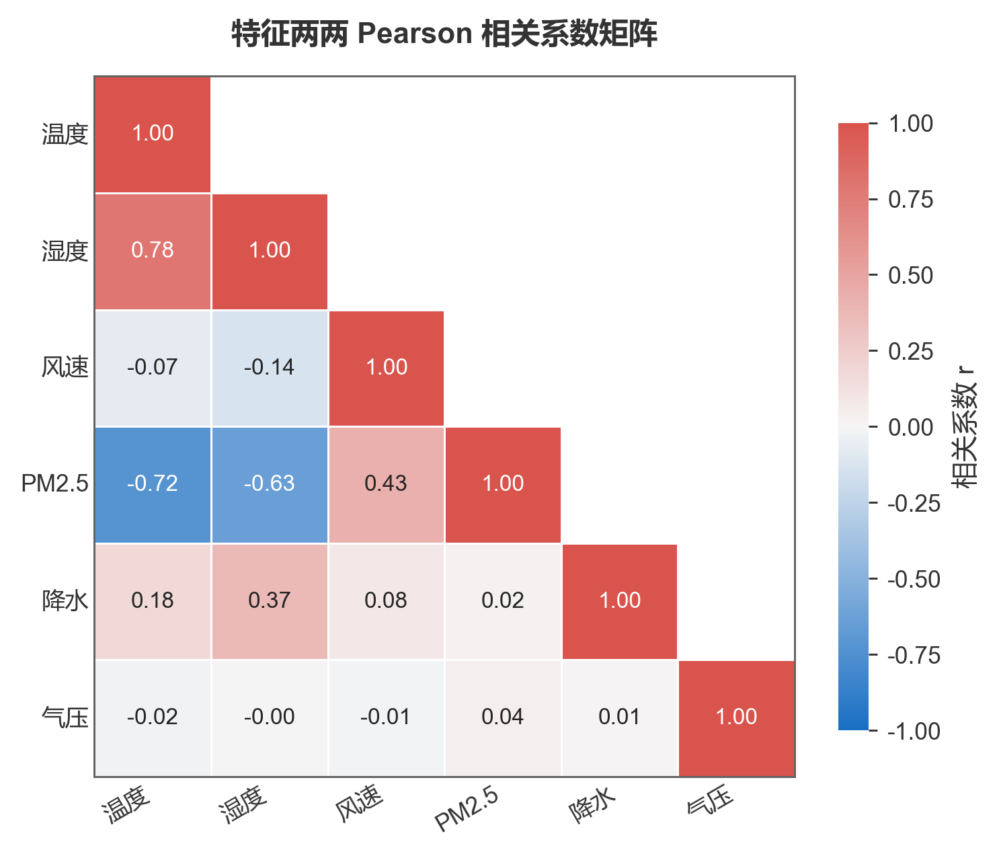
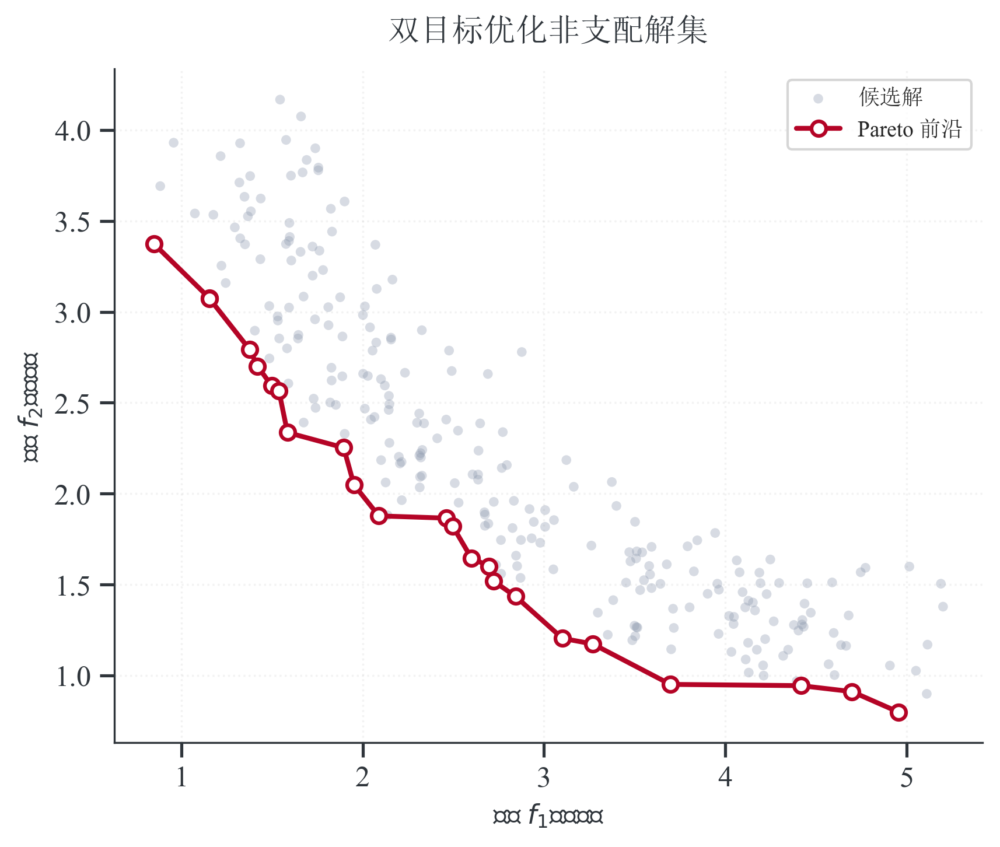
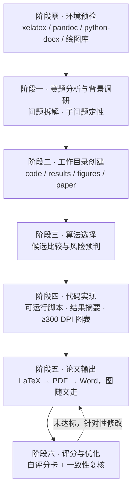

<h1 align="center">数学建模竞赛技能集</h1>

---

<p align="center"><b>mathmodel-kit · 开放的数模工具箱 · Open Modeling Toolbox</b></p>

<p align="center">
  把数模竞赛的每一步（赛题分析 · 模型构建 · 算法实现 · 出版级图表 · 论文成稿 · 降 AI 与交付核查 · 结构自检与评分）<br>
  做成能按统一接口调用、也能被程序校验的技能与数据——<b>面向参赛者，也面向需要规范配图、排版与交付核查的研究者</b>。
</p>

<p align="center">
  <a href="https://github.com/Escap1ng/mathmodel-kit/actions/workflows/ci.yml"></a>
  <a href="https://github.com/Escap1ng/mathmodel-kit/actions/workflows/paper.yml"></a>
  
  
  
  
  <a href="CONTRIBUTING.md"></a>
</p>

<p align="center">
  <b>简体中文</b> &nbsp;·&nbsp; <a href="README_EN.md">English</a>
</p>

---

> **能交给机器校验的，都交给技能；该由人判断的，留给人。**
> 数据可复现、图表不裁切不重叠、论文数字能追溯到脚本产物、格式过得了自检——这些由技能保证；方法选型、结果解释、创新点怎么写，仍由你来定。

**目录**：[快速开始](#快速开始) · [这是什么](#这是什么) · [为什么用它](#为什么用它) · [开放设计](#开放设计) · [效果预览](#效果预览) · [出图风格与主题](#出图风格与主题) · [工作流与质量门禁](#工作流与质量门禁) · [文档地图](#文档地图) · [仓库结构](#仓库结构) · [依赖](#依赖) · [常见问题](#常见问题) · [扩展与贡献](#扩展与贡献) · [路线图](#路线图) · [定位与合规声明](#定位与合规声明) · [致谢](#致谢)

## 快速开始

六步跑通。七个技能彼此独立——复制哪一个到技能目录，哪一个就能单独用，也能由主技能串成一条完整流程。

```bash
# 1. 装技能：复制进宿主的技能目录即可，不需要安装任何框架（示例为 Claude Code）
cp -r skills/mathmodel-figure ~/.claude/skills/
# 之后在对话里直接说需求，如「用云雨图对比三组实验的耗时分布」「把这张参考图重画成技术路线图」

# 2. 数据图表：产物输出到 绘图复刻/outputs/（300 DPI PNG + 矢量 PDF + SVG）
cd skills/mathmodel-figure
python3 code/tools/render_template.py --list                     # 查看 20 个模板 id
python3 code/tools/render_template.py paired-raincloud           # 支持 id / 英文别名 / 中文图题片段
python3 code/tools/render_template.py 模块占比环形图               # 中文图题也能匹配
python3 code/tools/render_template.py --list-themes              # 配色主题可整套替换

# 3. 学术示意图：由 content JSON 驱动，改内容不动版式
cd ../mathmodel-diagram
python3 code/tools/render_template.py roadmap-5band content.json -o out.png   # 300 dpi PNG + 同名矢量 PDF
python3 code/tools/render_template.py roadmap-5band content.json --check      # 只查容量是否超框，不写文件
python3 code/tools/validate_content.py roadmap-5band content.json             # 按内容契约校验
```

```bash
# 4. 论文输出：填骨架 → 编译 → 转 Word → 调版式（mathmodel-paper）
cd skills/mathmodel-paper && cp templates/paper.tex paper/
cd paper && xelatex -interaction=nonstopmode paper.tex && xelatex -interaction=nonstopmode paper.tex
pandoc paper.tex -o paper.docx                                   # 公式自动转成 Word 原生格式
cd .. && python3 code/word_postprocess.py paper/paper.docx       # 只调版式，不改内容

# 5. 降 AI 门禁（mathmodel-deai）：词表级查模板腔/套话、结构级查句式与段落节奏、字符级清零宽/不可见字符
cd ../mathmodel-deai
python3 code/check_phrasing.py ../mathmodel-paper/paper/paper.tex                              # 词表级（退出码 0 才算过）
python3 code/check_style.py ../mathmodel-paper/paper/paper.tex                                 # 结构级 + 风险等级
python3 code/strip_invisible.py --clean ../mathmodel-paper/paper/paper.pdf ../mathmodel-paper/paper/paper.docx   # 交付门禁
python3 code/strip_invisible.py ../mathmodel-paper/paper/paper.pdf ../mathmodel-paper/paper/paper.docx           # 复检须退出 0

# 6. 结构自检与评分（mathmodel-score）：章节结构门槛 + 五维评分卡（≥85 达标）
cd ../mathmodel-score
python3 code/check_chapters.py ../mathmodel-paper/paper/paper.tex              # 结构门槛：hard 未过先补齐（0 通过 / 1 未过）
python3 code/check_chapters.py --list-checks                                     # 查看结构契约（hard/soft/人工）
python3 code/score_card.py --list-dimensions                                     # 查看五维契约（含满分）
python3 code/score_card.py scorecard.json                                        # 退出码 0 达标 / 1 需优化 / 2 输入错误
python3 code/score_card.py scorecard.json --json                                 # 机器可读输出（含扣分明细）
```

模板库里没有合适图型时，按 [`nature-standard.md`](skills/mathmodel-figure/docs/guides/nature-standard.md) 自己画
（照样 `from plot_style import ...` 复用同一套样式）；摘要怎么写见
[`abstract-template.md`](skills/mathmodel-paper/templates/abstract-template.md)。

## 这是什么

`mathmodel-kit` 是一个**开放的数模工具箱**：七个技能既能单独用，也能由主技能串成一条完整流程，
另配一套**机器可读的模板注册表与内容契约**——别的程序能列举、校验并调用这些能力，而不是面对一堆提示词。

评分与结构自检**默认按国赛口径**（对齐 2026 格式规范），可用 `--rules mcm` 切到**美赛**；去 AI 词表中英双语，
英文摘要与图注同样受检。

| 技能 | 职责 | 入口 | 产物 |
|---|---|---|---|
| [`mathmodel-core`](skills/mathmodel-core/SKILL.md) | **主技能（编排与路由）**：按阶段零至阶段六编排全程（赛题分析 → 模型构建 → 算法实现 → 论文输出 → 评分优化），并把各环节交给对应专项技能 | 提交赛题或建模需求即触发 | 工作目录骨架、代码与结果、论文与评分报告 |
| [`mathmodel-methods`](skills/mathmodel-methods/SKILL.md) | **建模方法库与选型**：按问题族（评价/排序、优化、预测、分类聚类、微分方程、仿真、信号、前沿创新）给出候选方法、选型依据、实现入口与验证方式 | 问「这题用什么算法」或需要选型对比时触发 | 方法清单、候选对比表、推荐库与最小骨架、验证方式 |
| [`mathmodel-figure`](skills/mathmodel-figure/SKILL.md) | **数据图表**：20 个 matplotlib 模板 + 模板库外的 Nature 出图标准 | `python3 code/tools/render_template.py <模板id>` | 300 DPI PNG + 矢量 PDF + SVG + 可改脚本 |
| [`mathmodel-diagram`](skills/mathmodel-diagram/SKILL.md) | **学术示意图**：5 个 JSON 驱动版式模板，另支持从零手绘与照参考图高保真复刻 | `python3 code/tools/render_template.py <模板id> content.json` | 300 DPI PNG + 矢量 PDF + content JSON |
| [`mathmodel-paper`](skills/mathmodel-paper/SKILL.md) | **论文写作与排版**：写作规范（结构/摘要五段式/模型建立与求解/公式/评价/附录/语言表述）+ LaTeX 骨架与页面设置 + pandoc → Word 版式微调 + 参考文献规范 | `xelatex` + `word_postprocess.py` | 合规 `.pdf` 与 `.docx`、摘要模板、写作与排版规范 |
| [`mathmodel-deai`](skills/mathmodel-deai/SKILL.md) | **降 AI 与交付核查**：词表级去 AI（模板腔/套话/空泛/伪洞察）+ 结构级（长句/句式重复/段落节奏/小数位）+ 零宽/不可见字符清理 | `check_phrasing.py` + `check_style.py` + `strip_invisible.py` | 表述级检查报告与风险等级、无不可见字符的 `.pdf`/`.docx` |
| [`mathmodel-score`](skills/mathmodel-score/SKILL.md) | **结构自检与评分**：章节结构契约（摘要三段式、问题重述/分析、假设编号、符号说明三线表、模型评价优缺点、附录源程序、AI 使用声明、匿名，对齐国赛 2026 格式规范）+ 百分制五维（摘要 30 / 算法模型 20 / 创新性 20 / 写作 15 / 排版 15） | `check_chapters.py` + `score_card.py <评分卡.json>` | 结构未过清单、评分表与达标判定（≥85）、扣分明细、优化轮次 |

技能清单的单一事实源是 [`skills/manifest.json`](skills/manifest.json)：登记每个技能的类型（core / knowledge / tool）、职责、入口、
文档与协作口径（`open` / `maintainer`），CI 校验它与 `skills/` 目录、上表与徽章计数一致。**主技能 `mathmodel-core` 由维护者掌握**，
其余技能接受外部贡献。

## 为什么用它

| 特性 | 说明 | 怎么验证 |
|---|---|---|
| **不被模板库绑住** | 画什么图，由数据结构和你要论证的结论决定；模板是加速器，不是边界 | 库里没有合适图型时按 [`nature-standard.md`](skills/mathmodel-figure/docs/guides/nature-standard.md) 自己画，用的是同一套样式常量，和模板图混排看不出差别 |
| **可复现** | 模板自带固定种子的模拟数据，示意图由 content JSON 驱动，产物随时能重渲、能接着改 | `--list` 挨个渲染即得同名 PNG/PDF/SVG；示意图 `--check` 只校验、不写文件 |
| **门禁由机器把守** | 不靠肉眼兜底：文字超框就直接非零退出，注册表与文档是否一致由 CI 强校验 | 见[工作流与质量门禁](#工作流与质量门禁)的完整门禁表 |
| **格式有据可依** | 章节结构逐条对齐国赛 2026 格式规范（摘要页起编页码、正文不超 30 页、附录须含可运行源程序、AI 使用声明、匿名），并给出国赛/美赛评阅侧重对照 | `check_chapters.py` 报出 hard/soft 未过项：hard 先补齐不计分，soft 按维度扣分 |
| **配色整套可换** | 配色是数据不是代码，写在主题文件里，能一次全换 | 改 `themes/*.theme.json` 或工作区 `scripts/theme.json`，共用样式模块的 9 个模板和自绘图一起跟着变 |
| **反造假** | 不许编文献、编数据；模拟结果不许说成复现了真实结果；论文里的数字必须能追到脚本产物 | 主技能规范与自检清单中的强制条目 |
| **AI 痕迹可查可改** | 模板腔、套话、空泛与伪洞察句式，以及长句、句式重复、段落节奏等结构痕迹，都由**词表 + 阈值驱动**的检查器扫出（词表中英双语），规则与阈值是数据、可扩展 | `check_phrasing.py` / `check_style.py` 命中即非零退出；加词只改 `phrasing-blacklist.json`，调阈值只改 `check_style.py` 头部常量 |

## 开放设计

「开放」不是喊口号，而是能验证的事。四个维度都有实际产物，不靠人工同步的清单，也不靠口头承诺：

| 维度 | 开放了什么 | 产物在哪 |
|---|---|---|
| **契约开放** | 技能清单、模板清单、字段结构、取值范围、主题结构、章节检查项全部机器可读 | [`skills/manifest.json`](skills/manifest.json)（技能类型与协作口径）、`manifest.json`、`code/templates/schema/*.schema.json`、`themes/theme.schema.json`、`mathmodel-score/code/chapter-checklist.json`（JSON Schema Draft 2020-12） |
| **接口开放** | 能力可列举、可校验、可被别的程序编排 | 统一的命令行入口，加上统一的退出码约定：`0` 成功 / `1` 校验或渲染失败 / `2` 用法或环境出错 |
| **协作开放** | 外部开发者能加模板、改文档、报缺陷，而且只改两处 | 注册表加一行 + 索引文档加一行，其余一致性由 CI 自动校验 |
| **许可开放** | 可商用、可二次分发 | [Apache-2.0](LICENSE)，贡献即表示同意以同一许可发布 |

```bash
python3 code/tools/render_template.py --list --json                   # 输出注册表，供程序读取
python3 code/tools/render_template.py <模板id> content.json --check    # 机器可判定的渲染自检
python3 code/tools/validate_content.py <模板id> content.json           # 按 JSON Schema 校验内容契约
python3 code/tools/validate_theme.py <主题文件>                         # 校验自定义配色主题
```

接口的稳定承诺分三档，方便判断什么能动、什么不能动：**Stable**（稳定，第三方可依赖：命令行参数与退出码、
注册表字段与主题契约字段、`schema_version` 语义、产物格式与路径）、**Experimental**（试验，可能调整：`--lang` 文案、
`--json` 字段顺序、错误信息措辞）、**Internal**（内部，不做承诺：脚本内的几何常量与基元签名）。
主题的**字段结构**属于 Stable，**具体色值**属于内容。

### 未来会更开放

把「还没做」也写出来，是为了让你知道能依赖什么：

| 时间 | 更开放在哪 | 状态 |
|---|---|---|
| **现在** | 契约 / 接口 / 协作 / 许可四项已落地；配色主题覆盖共用样式模块的 9 个图表模板与自绘图 | 已交付 |
| **Phase 2** | 主题控制扩展到全部 25 个模板（消除配色两套写法）；补齐多宿主安装说明；登记进社区索引，方便第三方发现和引用 | 规划中 |
| **Phase 3** | 可安装的命名空间包与面向第三方程序的稳定 Python API，让本项目能被**嵌进别人的流程**，而不只是被复制 | 以真实需求为触发条件 |

每条都写进[白皮书](docs/upgrade-plan.md)并注明**触发条件**——不做没有说法的承诺；
破坏性变更一律记入 [CHANGELOG.md](CHANGELOG.md)。

## 效果预览

下面 6 张取自 20 个数据图表模板，按类型各挑一个代表。**点缩略图可看原图**，每张下面标了模板 id，
照此命令即可复现——`python3 code/tools/render_template.py <模板id>`，产物输出到 `绘图复刻/outputs/`；
全部 20 张见 [`figure-catalog.md`](skills/mathmodel-figure/docs/templates/figure-catalog.md)。

| 对比 | 分布 | 相关性 |
|---|---|---|
| <a href="skills/mathmodel-figure/examples/previews/grouped_bar_replica.png"></a><br>`grouped-bar` 分组柱状图<br><sub>多方案指标对比 · 增益标注</sub> | <a href="skills/mathmodel-figure/examples/previews/paired_raincloud_replica.png"></a><br>`paired-raincloud` 配对云雨图<br><sub>分布形态 + 配对差异一图看完</sub> | <a href="skills/mathmodel-figure/examples/previews/heatmap_annotated_replica.png"></a><br>`heatmap-annotated` 相关热力图<br><sub>数值标注 + 上三角遮罩</sub> |

| 评价 | 权衡 | 网络构成 |
|---|---|---|
| <a href="skills/mathmodel-figure/examples/previews/taylor_diagram_replica.png"></a><br>`taylor-diagram` 多模型泰勒图<br><sub>标准差 · 相关系数 · 均方根误差同图</sub> | <a href="skills/mathmodel-figure/examples/previews/pareto_front_replica.png"></a><br>`pareto-front` Pareto 前沿<br><sub>非支配解集 · 拐点与理想点</sub> | <a href="skills/mathmodel-figure/examples/previews/nature_chord_diagram_replica.png"></a><br>`nature-chord-diagram` 和弦图<br><sub>流向与流量占比</sub> |

预览图由模板渲染器直接导出——改了样式重新渲染即可覆盖，不会出现「预览和代码不一致」。

## 出图风格与主题

数据图表的常见图型**默认**按 Nature 版式出图：小字无衬线、轴线细、图例精简；颜色只有四种用途，黑白打印也分得清。
这只是默认值，不是硬性规定——配色写在主题文件里，可以整套换掉。

| 用途 | 默认取色 | 规则 |
|---|---|---|
| 身份 |  主角蓝，次系列橙 / 紫 / 青 / 珊红 | 同一个方法，全文每张图都是同一种颜色 |
| 基准 |  中灰 | 对照、均值、参考线永远是灰 |
| 方向 |   | 只标有正负的变化量，并带 `↑/↓`，黑白打印也认得出 |
| 层级 | 同色系由深到浅 | 主要证据深、辅助信息浅，靠深浅分主次，而不是换颜色 |

```bash
python3 code/tools/render_template.py grouped-bar --theme nature    # 默认主题，可省略
python3 code/tools/render_template.py grouped-bar --theme ./my.theme.json
```

渲染时会把主题写进工作区的 `scripts/theme.json`，所以**工作区自成一体**：脚本连主题一起交出去，谁重跑都是同一套颜色；
想换色，**改这份副本就行**，不必动仓库里的模板。目前主题覆盖共用 `plot_style.py` 的 9 个模板和按同一模块自绘的图；
其余 11 个模板与 5 个示意图的配色写在各自脚本开头（仍可在工作区副本里改），已排进 [Phase 2](#未来会更开放)。

换主题可以换色值，但不能把这四种用途丢掉，否则图的读法就变了。条文见
[`visualization-rules.md`](skills/mathmodel-figure/docs/guides/visualization-rules.md)，主题怎么写见
[`themes/README.md`](skills/mathmodel-figure/themes/README.md)。

## 工作流与质量门禁



凡是机器能判的，都不靠肉眼兜底：

| 门禁 | 什么时候触发 | 怎么处理 |
|---|---|---|
| 中文字宽校验 | 示意图每次渲染前，逐个槽位量宽 | 超出就报出是哪个槽、超了多少，并以非零码退出 |
| 内容契约校验 | 提交或复用 content JSON 时 | 不符合 JSON Schema 直接失败（`--all` 可批量校验内置示例） |
| 注册表一致性 | 每次 push / PR | 图表与示意图登记表 ↔ 文件系统 ↔ 索引文档 ↔ 版本号 ↔ README 模板徽章，以及技能清单 ↔ 技能目录 ↔ README 技能表 ↔ 技能徽章，都必须对得上 |
| 零宽字符清理 | 论文交付前 | PDF 与 Word 都要清理并复检，退出码为 0 才算过 |
| 表述级去 AI 检查 | 论文正文与摘要定稿后 | 词表级 `check_phrasing.py` 扫模板腔/套话/空泛（中英双语），结构级 `check_style.py` 扫句长/句式重复/段落节奏/小数位；命中即非零退出，改写后复检，风险等级「高/极高」不得交付。**表述口径以本技能为准**，评分模块文档也须通过这两道检查 |
| 章节结构自检 | 论文成稿后、评分前 | `check_chapters.py` 核对 hard 项（符号说明三线表、模型评价优缺点、附录可运行源程序、匿名、国赛无目录），未过先补齐、不计分；soft 项按维度扣分（可选 `--rules mcm` 用美赛口径） |
| 自评分卡 | 阶段六 | 按五维填评分卡，`score_card.py` 校验并判定（≥85 达标；一票否决直接淘汰，熔断 3 轮） |

## 文档地图

README 只讲「是什么、怎么用」，细节在下面这些文档里——按需取用，不必从头读完：

| 你想做什么 | 看哪份 |
|---|---|
| 改图、换配色、加模板 | [`mathmodel-figure/SKILL.md`](skills/mathmodel-figure/SKILL.md) · [`themes/README.md`](skills/mathmodel-figure/themes/README.md) |
| 写论文、按竞赛口径排版 | [`mathmodel-paper/SKILL.md`](skills/mathmodel-paper/SKILL.md) · [`writing-rules.md`](skills/mathmodel-paper/docs/writing-rules.md) · [`typesetting-rules.md`](skills/mathmodel-paper/docs/typesetting-rules.md) · [`references.md`](skills/mathmodel-paper/docs/references.md) |
| 去 AI 味、清零宽/不可见字符 | [`mathmodel-deai/SKILL.md`](skills/mathmodel-deai/SKILL.md) · [`deai-rules.md`](skills/mathmodel-deai/docs/deai-rules.md) |
| 给论文打分、交付前自检 | [`mathmodel-score/SKILL.md`](skills/mathmodel-score/SKILL.md) · [`rubric.md`](skills/mathmodel-score/docs/rubric.md) · [`chapter-checklist.md`](skills/mathmodel-score/docs/chapter-checklist.md) · [`self-check.md`](skills/mathmodel-score/docs/self-check.md) |
| 画流程图 / 路线图 / 框架图 | [`mathmodel-diagram/SKILL.md`](skills/mathmodel-diagram/SKILL.md) |
| 走完整个竞赛流程 | [`mathmodel-core/SKILL.md`](skills/mathmodel-core/SKILL.md) |
| 选建模方法 / 定算法 / 做选型对比 | [`mathmodel-methods/SKILL.md`](skills/mathmodel-methods/SKILL.md) |
| 出图规范（唯一权威） | [`visualization-rules.md`](skills/mathmodel-figure/docs/guides/visualization-rules.md) · [`nature-standard.md`](skills/mathmodel-figure/docs/guides/nature-standard.md) |
| 参与贡献（子模块 / 标准 / 审核 / 角色权限） | [`CONTRIBUTING.md`](CONTRIBUTING.md)（[English](CONTRIBUTING_EN.md)） |
| 了解为什么这样设计 | [白皮书](docs/upgrade-plan.md)（[English](docs/upgrade-plan_EN.md)）· [`CHANGELOG.md`](CHANGELOG.md) |

## 仓库结构

```
mathmodel-kit/
├── README.md · README_EN.md        # 中英文档
├── CONTRIBUTING.md · CONTRIBUTING_EN.md
├── CHANGELOG.md · VERSION          # 更新日志与版本号（发版时 release.yml 校验三处一致）
├── LICENSE                         # Apache License 2.0
├── requirements.txt                # 自带脚本的依赖清单（下限约束，CI 与本地共用）
├── docs/upgrade-plan.md            # 白皮书：开放接口、数据契约、治理与版本策略
└── skills/
    ├── manifest.json               # 技能注册表（唯一来源：类型 / 职责 / 入口 / 协作口径）
    ├── mathmodel-core/             # 主技能（编排与路由）：阶段零至阶段六工作流
    ├── mathmodel-methods/          # 建模方法库与选型：docs/（方法库、选型指南、实现指南）
    ├── mathmodel-figure/           # 数据图表：code/templates（20 模板）· code/style · themes/ · examples/previews
    ├── mathmodel-diagram/          # 学术示意图：code/templates（5 模板）+ schema/ · code/tools · examples/
    ├── mathmodel-paper/            # 论文写作与排版：docs/（写作、排版、参考文献规范）· templates/ · code/（Word 微调）
    ├── mathmodel-deai/             # 降 AI：code/（表述级检查器 + 词表 + 零宽清理器）· docs/（降 AI 规范）· examples/
    └── mathmodel-score/            # 结构自检与评分：code/（章节契约 + 检查器 + 评分卡）· docs/（rubric、chapter-checklist、self-check）· examples/
```

技能分三类（以 [`skills/manifest.json`](skills/manifest.json) 为准）：**core**（编排与路由，只有 `SKILL.md`）、
**knowledge**（规范或方法库，`SKILL.md` + `docs/`，如 `mathmodel-methods`、`mathmodel-paper`）、
**tool**（`code/` + `docs/` + `examples/`）。`code/tools/manifest.json` 是模板的唯一来源，新增模板只需在注册表和索引文档各加一行。

## 依赖

| 用途 | 需要什么 |
|---|---|
| 数据图表 / 学术示意图 | Python 3.12+ 与 `matplotlib` / `numpy`；图表另需 `seaborn` |
| 论文编译 | `xelatex`（需支持中文）+ `pandoc` |
| Word 版式微调 | `python-docx` |
| PDF 零宽字符清理 | `PyMuPDF` |
| 契约校验（可选） | `jsonschema`；没装时校验器自动降级为内置的最小校验 |

自带脚本的依赖清单是 [`requirements.txt`](requirements.txt)（下限约束，CI 与本地共用同一份：
`pip install -r requirements.txt`）。`pandas`、`scipy`、`openpyxl` 等只在你自己写数据处理代码时才会用到，
仓库自带脚本不依赖它们。
CI 以 Python 3.12 为最低验证环境。Linux / macOS 上如果没有中文字体，样式模块会告警并回退，
图里的中文可能显示成方框，装 `Noto Sans CJK SC` 即可。

## 常见问题

| 现象 | 怎么办 |
|---|---|
| 图里中文显示成方框 | 系统缺中文字体；装 Microsoft YaHei / SimHei / Noto Sans CJK 后重新渲染（`plot_style` 会明确告警，不会静默出方框） |
| 轴标签的中文变方框，公式却正常 | 别把 mathtext 和中文混排：`"问题规模 $n$（个）"` 改成纯文本 `"问题规模 n（个）"` |
| 黑白打印分不清系列 | 靠深浅梯级、线型和标记的冗余区分、直接标注；红绿只出现在带 `↑/↓` 的增量上 |
| 想换配色 | 改工作区 `绘图复刻/scripts/theme.json` 的色值，9 个模块化模板和自绘图都会跟着变（见[出图风格与主题](#出图风格与主题)） |
| 提示「未知模板」 | 先 `--list` 查 id，也可以用英文别名或中文图题片段匹配 |
| 示意图提示「缺少字段」 | 先用 `validate_content.py` 定位缺哪个必备字段，字段全集见 `code/templates/schema/` |
| 论文被判「AI 味重」 | 先 `check_phrasing.py` 看命中词句、`check_style.py` 看风险等级；词表可扩展（加词只改 `phrasing-blacklist.json`），改完复检到退出 0 |
| 论文缺结构项（符号说明 / 模型评价 / 附录源程序） | `check_chapters.py` 会逐项列出 hard/soft 未过项：hard 先补齐再评分；完整契约用 `--list-checks` 查看 |
| 不知道该按国赛还是美赛准备 | 默认国赛口径（对齐 2026 格式规范）；`--rules mcm` 切美赛（放宽目录要求、按 25 页提交限制），评阅侧重对照见 `mathmodel-score/docs/rubric.md` 末节 |

## 扩展与贡献

加模板、补示例、改文档、报缺陷，都欢迎。可协作的事收敛成四个子模块，每个子模块都给出**贡献标准 → 提交规范 → 审核流程**；子模块间的交接与同步规则、贡献者角色与权限见 [`CONTRIBUTING.md`](CONTRIBUTING.md)（[English](CONTRIBUTING_EN.md)）：

| 子模块 | 你可以做什么 | 入口 |
|---|---|---|
| **M1 文档与示例** | 补规范、纠错、加示例与预览 | PR（`docs: …`），索引表与注册表同一次提交 |
| **M2 代码与模板** | 新增模板（注册表一行 + 索引文档一行）、修脚本与工具 | PR（`feat: …`），CLI 与 CI 无需改动 |
| **M3 测试与验证** | 本地跑门禁、补 CI 冒烟用例 | PR 附实际跑过的命令与输出，CI 全绿是合并门槛 |
| **M4 问题反馈与需求** | 报缺陷（附最小复现）、提模板需求、指出文档问题 | [Issue 表单](https://github.com/Escap1ng/mathmodel-kit/issues/new/choose) |

其中**加模板**最常见，只需「注册表一行 + 索引文档一行」，不用动命令行、CI 和版本号。
能由机器判定的（语法、注册表一致性、内容契约、渲染能否成功）交给 CI，人只审语义与原创性；
贡献者会在注册表 `author` 字段和 [CHANGELOG.md](CHANGELOG.md) 里署名，角色权限分报告者 / 贡献者 / 评审者 / 维护者四档。

[开 Issue 报缺陷或提新模板](https://github.com/Escap1ng/mathmodel-kit/issues/new/choose)
· [看已有的 PR](https://github.com/Escap1ng/mathmodel-kit/pulls) ·
拿不准要不要做？先开 Issue 聊聊，别直接写代码。

## 路线图

| 阶段 | 目标 | 开放到什么程度 | 状态 |
|---|---|---|---|
| **Phase 1** | 补齐契约与治理：注册表、内容契约、主题契约、统一命令行、CI 一致性校验、贡献与版本规范 | 能力可被列举、校验、替换 | **已交付** |
| **Phase 2** | 生态与分布：主题覆盖全部 25 个模板、多宿主安装说明、登记进社区索引、贡献者案例、英文文档对齐 | 从「能被复制」到「能被发现和引用」 | 规划中 |
| **Phase 3** | 开放组件化：可安装的命名空间包 / 面向第三方程序的稳定 Python API | 从「能被引用」到「能嵌进别人的流程」 | 条件触发 |

这张表只写有触发条件的事：Phase 3 要等出现明确的第三方程序化调用需求才启动，而不是「有空就做」；
做成什么样、什么时候做，都会先写进[白皮书](docs/upgrade-plan.md)再动手。

## 定位与合规声明

这个项目的定位是**提效与校验**，不做「代写」：能机械校验的部分交给技能，
**方法选型、结果解释、创新点怎么写，留给人**。技能里内置了反造假要求——不编文献、不编数据、
模拟结果不许说成复现了真实结果、论文里的数字必须能追到脚本产物。

这不是能力不够的将就，而是一个能长期站得住的定位：各赛事对 AI 使用的规定不一，而且逐年收紧，
项目的价值不能建立在「规则暂时不管」之上。学术诚信最终由使用者负责，技能只把机械环节做扎实。

## 致谢

以下开源项目为本套件的部分设计与规则提供了来源，按影响顺序致谢：

| 项目 | 借鉴内容 |
|---|---|
| [math-modeling-skill](https://github.com/Escap1ng/math-modeling-skill) · MIT | 同账号下的前序项目（单文件 `SKILL.md` 的数模辅助技能）：主技能编排、算法库、可视化与排版规范、百分制评分体系由它演化而来 |
| [no-ai-slop](https://github.com/petergyang/no-ai-slop) · MIT | 降 AI 技能的句式规则分类（模板腔开头、二元对照、冒号揭晓、伪洞察、虚假深刻收尾等）；英文模式清单整理为 [`no-ai-slop-reference.md`](skills/mathmodel-deai/docs/no-ai-slop-reference.md)（保留上游版权声明），并落为词表规则 `en-slop-*` |
| [watermarks-remover](https://github.com/guillaumemeyer/watermarks-remover) | 降 AI 技能字符级清理器 `strip_invisible.py` 的字符集与保护逻辑（Layer A）来自它的 `text_unicode.py` |
| [MathModeling-skills](https://github.com/zhnnky329/MathModeling-skills) | 数据图表的 Nature 用色分工，以及「渲染完先看图再交付」的流程纪律（`math-figure-generator` 技能） |

其中 `no-ai-slop` 的核心主张与本项目一致：**去除 AI 味，但不抹平个人声音**。

## 许可证

[Apache License 2.0](LICENSE)
