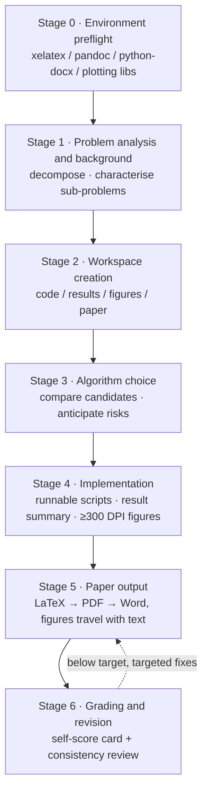

<h1 align="center">Math Modeling Contest Skill Kit</h1>

---

<p align="center"><b>mathmodel-kit · An open toolbox for math modeling contests</b></p>

<p align="center">
  A deterministic toolbox for modeling contests: it turns "problem analysis → model building → implementation →<br>
  publication-grade figures → paper and grading" into contract-callable skills and machine-readable data —<br>
  <b>for contestants, and for researchers who need compliant figures, typesetting and delivery checks</b>.
</p>

<p align="center">
  <a href="https://github.com/Escap1ng/mathmodel-kit/actions/workflows/ci.yml"></a>
  <a href="https://github.com/Escap1ng/mathmodel-kit/actions/workflows/paper.yml"></a>
  
  
  
  
  <a href="CONTRIBUTING_EN.md"></a>
</p>

<p align="center">
  <a href="README.md">简体中文</a> &nbsp;·&nbsp; <b>English</b>
</p>

---

> **The skills own mechanical correctness; the user owns modeling judgment.**
> Reproducible data, figures free of clipping and overlap, paper numbers traceable to script output, layout passing self-checks — guaranteed by the skills. Method choice, result interpretation and novelty claims stay with you.

**Contents**: [Quick start](#quick-start) · [What is this](#what-is-this) · [Why use it](#why-use-it) · [Open by design](#open-by-design) · [Gallery](#gallery) · [Figure style and themes](#figure-style-and-themes) · [Workflow and quality gates](#workflow-and-quality-gates) · [Documentation map](#documentation-map) · [Repository layout](#repository-layout) · [Dependencies](#dependencies) · [FAQ](#faq) · [Extending and contributing](#extending-and-contributing) · [Roadmap](#roadmap) · [Positioning and integrity](#positioning-and-integrity) · [Acknowledgements](#acknowledgements)

## Quick start

Four steps, each usable on its own — every skill is self-contained: copy one and it works independently.

```bash
# 1. Install a skill: copy it into your host's skills directory — no framework to install (Claude Code shown)
cp -r skills/mathmodel-figure ~/.claude/skills/
# Then just state your need in chat, e.g. "compare the runtime distribution of three groups with a raincloud plot"

# 2. Data figures: outputs land in 绘图复刻/outputs/ (300 DPI PNG + vector PDF + SVG)
cd skills/mathmodel-figure
python3 code/tools/render_template.py --list                     # list all 20 template ids
python3 code/tools/render_template.py paired-raincloud           # id / English alias / Chinese title fragment
python3 code/tools/render_template.py 模块占比环形图               # Chinese chart titles match too
python3 code/tools/render_template.py --list-themes              # colour themes are swappable

# 3. Academic diagrams: JSON-driven — content changes, geometry does not
cd ../mathmodel-diagram
python3 code/tools/render_template.py roadmap-5band content.json -o out.png   # 300 dpi PNG + vector PDF
python3 code/tools/render_template.py roadmap-5band content.json --check      # capacity check only, writes nothing
python3 code/tools/validate_content.py roadmap-5band content.json             # validate the content contract
```

```bash
# 4. Paper output: fill the skeleton → strip source → compile → convert to Word → tune layout → delivery gate
cd skills/mathmodel-paper && cp templates/paper.tex paper/
python3 code/strip_invisible.py --clean paper/paper.tex          # strip zero-width/invisible chars before compiling
cd paper && xelatex -interaction=nonstopmode paper.tex && xelatex -interaction=nonstopmode paper.tex
pandoc paper.tex -o paper.docx                                   # formulas become native OMML automatically
cd .. && python3 code/word_postprocess.py paper/paper.docx       # layout only — never rebuilds content
python3 code/strip_invisible.py --clean paper/paper.pdf paper/paper.docx   # delivery gate: clean + re-check must exit 0
```

When no template fits, draw it per [`nature-standard.md`](skills/mathmodel-figure/docs/guides/nature-standard.md)
(still `from plot_style import ...`); the abstract guide is [`abstract-template.md`](skills/mathmodel-paper/templates/abstract-template.md).

## What is this

`mathmodel-kit` is an **open toolbox for math modeling**: four agent skills that work standalone or chained into a
closed loop by the main skill, plus **machine-readable template registries and content contracts** — capabilities you
can enumerate, validate and consume from other programs, not just a pile of prompts.

| Skill | Role | Entry point | Output |
|---|---|---|---|
| [`math-modeling-helper`](skills/math-modeling-helper/SKILL.md) | **Main skill**: orchestrates stages 0–6 (problem analysis → modeling → implementation → paper → grading) | Triggered by submitting a problem or modeling request | Workspace skeleton, code and results, paper and score report |
| [`mathmodel-figure`](skills/mathmodel-figure/SKILL.md) | **Data figures**: 20 matplotlib templates plus a Nature standard for chart types outside the library | `python3 code/tools/render_template.py <id>` | 300 DPI PNG + vector PDF + SVG + editable script |
| [`mathmodel-diagram`](skills/mathmodel-diagram/SKILL.md) | **Academic diagrams**: 5 JSON-driven layouts, plus hand-drawing and high-fidelity replication from a reference image | `python3 code/tools/render_template.py <id> content.json` | 300 DPI PNG + vector PDF + content JSON |
| [`mathmodel-paper`](skills/mathmodel-paper/SKILL.md) | **Paper output**: LaTeX skeleton → PDF → Word, with contest layout tuning and zero-width character scrubbing | `xelatex` + `word_postprocess.py` + `strip_invisible.py` | Compliant `.pdf` and `.docx` (no invisible characters), abstract template |

## Why use it

| Quality | What it means | Verifiable evidence |
|---|---|---|
| **Not bound by the template library** | The chart type follows your data structure and the claim you need to support; templates accelerate, they do not constrain | When nothing fits, draw it per [`nature-standard.md`](skills/mathmodel-figure/docs/guides/nature-standard.md) — same style constants as the templates, so mixed figures look consistent |
| **Deterministic and reproducible** | Templates ship seeded simulated data, diagrams are driven by content JSON, and any output can be re-rendered and edited further | `--list` plus one render yields matching PNG/PDF/SVG; diagram `--check` validates without writing files |
| **Machine-enforced gates** | Nothing relies on eyeballing: overflowing text exits non-zero, and registry/document consistency is enforced by CI | The five gates in [Workflow and quality gates](#workflow-and-quality-gates) |
| **Swappable palette** | Colour is data, not code: declared in a theme file and replaceable wholesale | Edit `themes/*.theme.json` or the workspace `scripts/theme.json`; the 9 module-based templates and hand-drawn figures follow |
| **Anti-fabrication rules** | No invented references or data; simulation must never be presented as reproducing a real result; every paper number must trace to script output | Hard requirements in the main skill's rules and self-check list |

## Open by design

"Open" is not a posture but a verifiable property. Each of four dimensions has an artifact, and none relies on a
hand-synced list or a verbal promise:

| Dimension | What is open | Artifact |
|---|---|---|
| **Open contracts** | Template lists, field structures, value constraints and theme structure are all machine-readable | `manifest.json`, `code/templates/schema/*.schema.json`, `themes/theme.schema.json` (JSON Schema Draft 2020-12) |
| **Open interfaces** | Capabilities can be enumerated, validated and orchestrated by other programs | Unified CLIs plus unified exit-code semantics: `0` success / `1` validation or render failure / `2` usage or environment error |
| **Open collaboration** | Third parties can add templates, fix docs or report bugs by touching two places | One registry line + one index-doc line; CI checks all remaining consistency |
| **Open licence** | Commercial use and redistribution allowed | [Apache-2.0](LICENSE); contributing means agreeing to the same licence |

```bash
python3 code/tools/render_template.py --list --json                   # emit the registry for programs
python3 code/tools/render_template.py <id> content.json --check        # machine-decidable render self-check
python3 code/tools/validate_content.py <id> content.json               # validate content against its JSON Schema
python3 code/tools/validate_theme.py <theme file>                      # validate a custom colour theme
```

Interface commitments come in three tiers: **Stable** (CLI parameters and exit codes, registry and theme contract
fields, `schema_version` semantics, artifact formats and paths), **Experimental** (exact `--lang` wording, `--json`
field order, error message phrasing) and **Internal** (geometry constants and primitive signatures inside scripts).
For themes, the **field structure** is Stable while the **colour values** are content.

### Where it gets more open

Listing what is *not* done yet is what makes it safe to depend on:

| When | Where it gets more open | Status |
|---|---|---|
| **Now** | Contracts / interfaces / collaboration / licence are in place; the palette theme covers the 9 module-based figure templates and hand-drawn figures | Delivered |
| **Phase 2** | Theme control extends to all 25 templates (removing the dual palette path); multi-host installation notes; listing in community indexes so third parties can find and cite the project | Planned |
| **Phase 3** | An installable namespace package and a stable Python API for third-party programs, so the project can be **embedded in someone else's pipeline** rather than copied | Conditional on real demand |

Every item goes into the [whitepaper](docs/upgrade-plan_EN.md) with an explicit **trigger condition** — no
undocumented promises — and every breaking change lands in [CHANGELOG.md](CHANGELOG.md).

## Gallery

Six representative figures out of 20 templates: **click a thumbnail for the full-resolution image**; the template id
sits under each one, so `python3 code/tools/render_template.py <id>` reproduces it into `绘图复刻/outputs/`. All 20 are
in [`figure-catalog.md`](skills/mathmodel-figure/docs/templates/figure-catalog.md).

| Comparison | Distribution | Correlation |
|---|---|---|
| <a href="skills/mathmodel-figure/examples/previews/grouped_bar_replica.png"></a><br>`grouped-bar` grouped bar<br><sub>multi-scheme metric comparison · gain labels</sub> | <a href="skills/mathmodel-figure/examples/previews/paired_raincloud_replica.png"></a><br>`paired-raincloud` paired raincloud<br><sub>distribution shape and pairing in one view</sub> | <a href="skills/mathmodel-figure/examples/previews/heatmap_annotated_replica.png"></a><br>`heatmap-annotated` annotated heatmap<br><sub>value labels + upper-triangle mask</sub> |

| Evaluation | Trade-off | Network / composition |
|---|---|---|
| <a href="skills/mathmodel-figure/examples/previews/taylor_diagram_replica.png"></a><br>`taylor-diagram` Taylor diagram<br><sub>std dev · correlation · RMSE in one plot</sub> | <a href="skills/mathmodel-figure/examples/previews/pareto_front_replica.png"></a><br>`pareto-front` Pareto front<br><sub>non-dominated set · knee and ideal point</sub> | <a href="skills/mathmodel-figure/examples/previews/nature_chord_diagram_replica.png"></a><br>`nature-chord-diagram` chord diagram<br><sub>flow direction and share</sub> |

Previews are exported straight from the template renderers, so a style change plus a re-render refreshes them —
previews can never drift from the code.

## Figure style and themes

Simple data chart types **default** to a Nature layout — small sans-serif type, thin axes, no redundant legends —
with colour carrying exactly four roles, so figures survive greyscale printing. It is a default, not a mandate:
the palette is declared in a theme file and can be swapped wholesale.

| Role | Value | Rule |
|---|---|---|
| Identity |  protagonist blue, then orange/purple/cyan/coral | The same method keeps the same colour in every figure of the paper |
| Baseline |  mid grey | Controls, means and reference lines are always grey |
| Direction |   | Only signed deltas, always with `↑/↓` so greyscale printing still reads |
| Hierarchy | Luminance ramp within a family (dark → light) | Primary evidence dark, supporting information light; never rely on hue to rank |

```bash
python3 code/tools/render_template.py grouped-bar --theme nature    # the default; can be omitted
python3 code/tools/render_template.py grouped-bar --theme ./my.theme.json
```

The theme is written into the workspace as `scripts/theme.json`, so the **workspace is self-contained** (hand someone
the script together with the theme and they reproduce identical colours) and **editing that copy overrides the
palette** without touching the bundled templates. Today it covers the 9 templates sharing `plot_style.py` plus figures
drawn with that module; the other 11 templates and the 5 diagrams keep their palettes in their script headers (still
editable in the workspace copy) — scheduled for [Phase 2](#where-it-gets-more-open).

A theme may change colour values but not remove those four roles, otherwise how the figure is read changes. The rules
are in [`visualization-rules.md`](skills/mathmodel-figure/docs/guides/visualization-rules.md); authoring a theme is
covered in [`themes/README.md`](skills/mathmodel-figure/themes/README.md).

## Workflow and quality gates



Nothing that a machine can decide relies on eyeballing:

| Gate | Trigger | Behaviour |
|---|---|---|
| Chinese text width check | Before every diagram render, per slot | Reports the overflowing slot and its budget, exits non-zero |
| Content contract validation | When a content JSON is written or reused | Fails on JSON Schema violations (`--all` validates every bundled example) |
| Registry consistency | Every push / PR | Registry ↔ filesystem ↔ index docs ↔ version ↔ README badges must agree |
| Zero-width character scrubbing | Before paper delivery | Both PDF and Word must be cleaned and re-checked; delivery requires exit code 0 |
| Self-score card | Stage 6 | 100-point five-dimension rubric; anything below target is fixed and re-scored |

## Documentation map

The README covers "what it is and how to use it"; the detail lives in these documents — take what you need:

| What you want to do | Read this |
|---|---|
| Restyle figures, swap palettes, add a template | [`mathmodel-figure/SKILL.md`](skills/mathmodel-figure/SKILL.md) · [`themes/README.md`](skills/mathmodel-figure/themes/README.md) |
| Write the paper, typeset to contest conventions | [`mathmodel-paper/SKILL.md`](skills/mathmodel-paper/SKILL.md) · [`abstract-template.md`](skills/mathmodel-paper/templates/abstract-template.md) |
| Draw flowcharts / roadmaps / frameworks | [`mathmodel-diagram/SKILL.md`](skills/mathmodel-diagram/SKILL.md) |
| Run the whole contest pipeline | [`math-modeling-helper/SKILL.md`](skills/math-modeling-helper/SKILL.md) |
| Figure rules (the single authority) | [`visualization-rules.md`](skills/mathmodel-figure/docs/guides/visualization-rules.md) · [`nature-standard.md`](skills/mathmodel-figure/docs/guides/nature-standard.md) |
| Submit code / add a template | [`CONTRIBUTING_EN.md`](CONTRIBUTING_EN.md) ([中文](CONTRIBUTING.md)) |
| Understand why it is designed this way | [Whitepaper](docs/upgrade-plan_EN.md) ([中文](docs/upgrade-plan.md)) · [`CHANGELOG.md`](CHANGELOG.md) |

## Repository layout

```
mathmodel-kit/
├── README.md · README_EN.md        # Chinese and English docs
├── CONTRIBUTING.md · CONTRIBUTING_EN.md
├── CHANGELOG.md · VERSION          # changelog and version (release.yml checks all three agree)
├── LICENSE                         # Apache License 2.0
├── docs/upgrade-plan.md            # whitepaper: open interfaces, data contracts, governance, versioning
└── skills/
    ├── math-modeling-helper/       # Main skill: stages 0–6, code and writing rules, grading rubric
    ├── mathmodel-figure/           # Data figures: code/templates (20) · code/style · themes/ · examples/previews
    ├── mathmodel-diagram/          # Diagrams: code/templates (5) + schema/ · code/tools · examples/
    └── mathmodel-paper/            # Paper: templates/ (paper.tex, abstract) · code/ (Word tuning, scrubbing)
```

Every skill follows the same internal layout: `code/` (scripts and registries), `docs/` (rules), `examples/`
(reproducible examples). `code/tools/manifest.json` is the single source of truth for templates — adding one means one
registry line plus one index-doc line.

## Dependencies

| Purpose | Requirements |
|---|---|
| Data figures / diagrams | Python 3.12+ with `matplotlib` / `numpy` (figures also need `seaborn` / `pandas`; the replication calibration script needs `scipy` / `Pillow`) |
| Paper compilation | `xelatex` (with CJK font support) + `pandoc` |
| Word tuning / reading problem attachments | `python-docx`; `openpyxl` (`xlrd` for legacy `.xls`), `PyMuPDF` |
| Contract validation (optional) | `jsonschema`; without it, validators fall back to a built-in minimal check |

CI verifies against Python 3.12 as the minimum. On Linux/macOS without CJK fonts the style module warns and falls
back — in-figure Chinese may render as boxes, so install `Noto Sans CJK SC`.

## FAQ

| Symptom | Fix |
|---|---|
| Chinese in figures shows as boxes | Missing CJK fonts; install Microsoft YaHei / SimHei / Noto Sans CJK and re-render (`plot_style` warns explicitly instead of silently drawing boxes) |
| Chinese in axis labels becomes boxes while formulas are fine | Never mix mathtext with Chinese: `"问题规模 $n$（个）"` becomes plain `"问题规模 n（个）"` |
| Series are indistinguishable in greyscale | Use the luminance ramp, redundant line/marker styles and direct labels; red/green appears only on deltas carrying `↑/↓` |
| Want to recolour | Edit the workspace `绘图复刻/scripts/theme.json` to override the 9 module-based templates and hand-drawn figures (see [Figure style and themes](#figure-style-and-themes)) |
| Renderer reports an unknown template | Run `--list` for ids, or match by English alias / Chinese title fragment |
| Diagram reports a missing field | Locate it with `validate_content.py`; the full field set is in `code/templates/schema/` |

## Extending and contributing

Adding templates, extra example scenarios, doc fixes and bug reports are all welcome; how to do each of the three
paths is in [`CONTRIBUTING_EN.md`](CONTRIBUTING_EN.md). **Adding a template** is the most common one and needs only
"one registry line + one index-doc line" — no changes to the CLI, CI or version. Machines decide what they can
(syntax, registry consistency, content contracts, successful rendering); humans review semantics and originality only.
Contributors are credited in the registry `author` field and in [CHANGELOG.md](CHANGELOG.md).

[Open an issue to report a bug or propose a template](https://github.com/Escap1ng/mathmodel-kit/issues/new/choose)
· [browse existing pull requests](https://github.com/Escap1ng/mathmodel-kit/pulls) ·
not sure whether it is worth doing? Open an issue first instead of writing code.

## Roadmap

| Phase | Goal | How much more open | Status |
|---|---|---|---|
| **Phase 1** | Contracts and governance: registries, content contracts, theme contract, unified CLIs, CI consistency checks, contribution and versioning rules | Capabilities can be enumerated, validated and replaced | **Delivered** |
| **Phase 2** | Ecosystem and distribution: themes covering all 25 templates, multi-host installation notes, listing in community indexes, contributor case studies, English docs aligned | From "can be copied" to "can be found and cited" | Planned |
| **Phase 3** | Open components: an installable namespace package / a stable Python API for third-party programs | From "can be cited" to "can be embedded in someone else's pipeline" | Conditional |

This table lists only things with a trigger condition: Phase 3 starts when a concrete third-party programmatic need
appears, not because there is spare time — what it looks like and when it happens are written into the
[whitepaper](docs/upgrade-plan_EN.md) before any code is written.

## Positioning and integrity

This project is positioned as **efficiency and verification**, not ghost-writing: mechanical correctness is
delegated to the skills, while **method choice, result interpretation and novelty claims stay with the human**. The
skills carry anti-fabrication rules — no invented references or data, simulation results may never be presented as
reproducing a real paper, and every number in the paper must trace back to script output.

This is not a compromise for lack of capability but a position that can last: contest rules on AI use differ and
tighten year by year, and this project's value does not depend on those rules tolerating ghost-writing. Academic
integrity ultimately rests with the user; the skills only make the mechanical parts solid.

## Acknowledgements

- [math-modeling-skill](https://github.com/Escap1ng/math-modeling-skill) — the predecessor project on the same
  account (a single-file `SKILL.md` modeling assistant, MIT licensed): this kit's main-skill orchestration, algorithm
  library, visualization and typesetting rules and 100-point rubric evolved from it;
- The Nature colour-role split for data figures and the "look at the rendered figure before shipping" discipline draw
  on the `math-figure-generator` skill in the community repository
  [MathModeling-skills](https://github.com/zhnnky329/MathModeling-skills).

## License

[Apache License 2.0](LICENSE)
