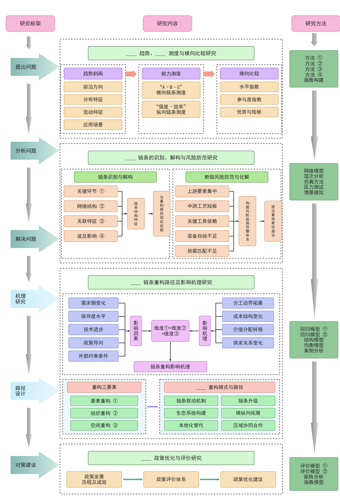
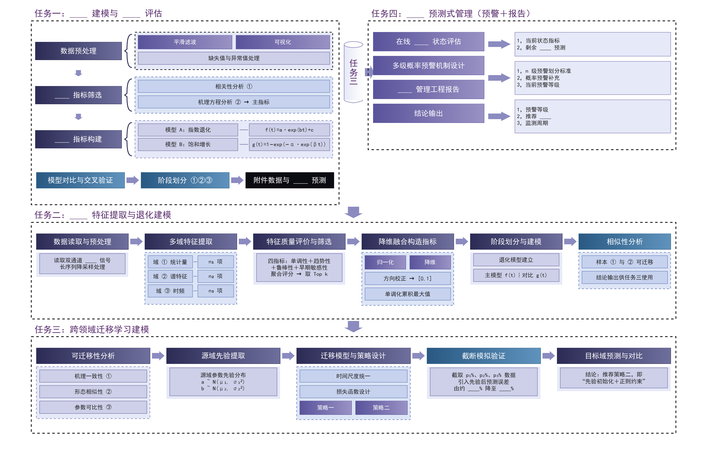
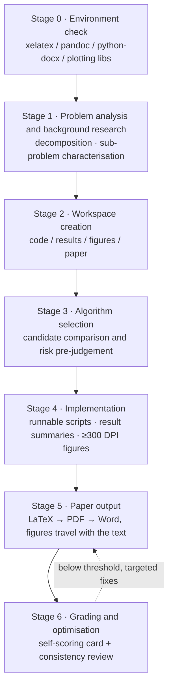

<h1 align="center">mathmodel-kit</h1>

<p align="center"><b>mathmodel-kit · An open toolbox for mathematical modeling contests</b></p>

<p align="center">
  A deterministic toolbox for modeling contests: it turns "problem analysis → model building → implementation →<br>
  publication-grade figures → paper and grading" into contract-callable skills and machine-readable data —<br>
  <b>for contestants, and for researchers who need compliant figures, typesetting and delivery checks</b>.
</p>

<p align="center">
  <a href="https://github.com/Escap1ng/mathmodel-kit/actions/workflows/ci.yml"></a>
  <a href="https://github.com/Escap1ng/mathmodel-kit/actions/workflows/paper.yml"></a>
  
  
  
  
  <a href="CONTRIBUTING_EN.md"></a>
</p>

<p align="center">
  <a href="README.md">简体中文</a> &nbsp;·&nbsp; <b>English</b>
</p>

---

> **The skills own mechanical correctness; the user owns modeling judgment.**
> Reproducible data, figures free of clipping and overlap, paper numbers traceable to script output, layout passing self-checks — all guaranteed by the skills. Method choice, result interpretation and novelty claims stay with you.

## Quick start in 30 seconds

```bash
# 1. Install a skill: copy it into your host's skills directory — no framework to install
cp -r skills/mathmodel-figure ~/.claude/skills/

# 2. Render: outputs land in 绘图复刻/outputs/ (300 DPI PNG + vector PDF + SVG)
cd skills/mathmodel-figure && python3 code/tools/render_template.py paired-raincloud

# 3. Recolour without touching code: a theme is a file — edit the workspace copy
python3 code/tools/render_template.py grouped-bar --theme nature
```

Not reading this end to end? Jump to the four steps in [Quick start](#quick-start), or take what you need from the
[Documentation map](#documentation-map).

## Table of contents

| Section | Contents |
|---|---|
| [Quick start in 30 seconds](#quick-start-in-30-seconds) | Three commands to a rendered figure and a recoloured one |
| [What is this](#what-is-this) | Four skills plus machine-readable registries and content contracts |
| [Open by design](#open-by-design) | Contracts / interfaces / collaboration / licence, and where it gets more open |
| [Why use it](#why-use-it) | Six differentiators, each backed by verifiable evidence |
| [Skill matrix](#skill-matrix) | Role, entry command and output for every skill |
| [Gallery](#gallery) | 25 previews, clickable thumbnails, template ids and reproduce commands |
| [Figure style and themes](#figure-style-and-themes) | Nature layout by default; the palette is declared in a theme file and can be swapped wholesale |
| [Workflow and quality gates](#workflow-and-quality-gates) | Stages 0–6 plus five machine-enforced gates |
| [Quick start](#quick-start) | Four steps through the full pipeline (including PDF/Word delivery) |
| [Documentation map](#documentation-map) | Which document covers what, and when to open it |
| [Repository layout](#repository-layout) | Directory tree and the job of each layer |
| [Dependencies and tested environment](#dependencies-and-tested-environment) | Requirements and version policy |
| [FAQ](#faq) | Common symptoms and fixes |
| [Extending and contributing](#extending-and-contributing) | Three paths in, and how review is split |
| [Roadmap](#roadmap) | Three open phases and their status |
| [Positioning and integrity](#positioning-and-integrity) | Where the human/AI line is drawn, and why |
| [Acknowledgements](#acknowledgements) · [License](#license) | Credits and terms |

## What is this

`mathmodel-kit` is an **open toolbox for mathematical modeling contests**: four agent skills usable separately or
chained together by the orchestrator, plus a set of **machine-readable template registries and content contracts** —
so its capabilities can be enumerated, validated and consumed by third-party programs, rather than being just prompts.

| Skill | Responsibility in one line |
|---|---|
| `math-modeling-helper` | **Orchestrator**: runs the whole contest through six stages — problem analysis → model building → implementation → paper → grading |
| `mathmodel-figure` | **Data figures**: 20 matplotlib templates plus a Nature standard for chart types outside the library |
| `mathmodel-diagram` | **Academic diagrams**: 5 JSON-driven layouts, plus authoring from scratch and high-fidelity replication of a reference image |
| `mathmodel-paper` | **Paper output**: LaTeX skeleton → PDF → Word, with contest-style layout tuning and zero-width character scrubbing |

Each skill is self-contained: copy whichever one you need into your host's skills directory and it works on its own.

## Open by design

"Open" here is a verifiable property, not a stance. All four dimensions have concrete artifacts behind them —
no hand-synchronised lists, no verbal promises:

| Dimension | What is open | Artifact |
|---|---|---|
| **Open contracts** | Template lists, field structures, value constraints and theme structure are machine-readable | `code/tools/manifest.json`, `code/templates/schema/*.schema.json`, `themes/theme.schema.json` (JSON Schema Draft 2020-12) |
| **Open interfaces** | Capabilities can be enumerated, validated and orchestrated by other programs | Unified CLIs with unified exit-code semantics: `0` success / `1` validation or rendering failure / `2` usage or environment error |
| **Open collaboration** | Third parties can add templates, fix docs and report bugs, editing just two places | One registry line + one index row; CI validates everything else |
| **Open licence** | Commercial use and redistribution permitted | [Apache-2.0](LICENSE); contributing means agreeing to the same licence |

Enumeration and validation entry points (identically named in both skills, same conventions):

```bash
python3 code/tools/render_template.py --list                     # list every template id
python3 code/tools/render_template.py --list --json              # emit the registry for programs
python3 code/tools/render_template.py <id> content.json --check  # machine-decidable render self-check
python3 code/tools/validate_content.py <id> content.json         # validate content against its JSON Schema
python3 code/tools/render_template.py --list-themes              # list swappable colour themes
python3 code/tools/render_template.py <id> --theme <name|path>   # render with another palette
python3 code/tools/validate_theme.py <theme file>                # validate a custom theme
```

Interface commitments come in three tiers: **Stable** (CLI parameters and exit codes, registry and theme
contract fields, `schema_version` semantics, artifact formats and paths), **Experimental** (exact `--lang`
wording, `--json` field order, error message phrasing) and **Internal** (geometry constants and primitive
signatures inside scripts). Breaking a Stable surface requires a `MAJOR` bump and a
[CHANGELOG.md](CHANGELOG.md) entry. For themes, the **field structure** is Stable (third parties may depend on
it) while the **colour values** are content (they change per theme).

### Where it gets more open

All four dimensions have artifacts today, and the boundaries are written down just as plainly — listing what is
*not* done yet is what makes it safe to depend on:

| When | Where it gets more open | Status |
|---|---|---|
| **Now** | Contracts / interfaces / collaboration / licence are in place; the palette theme covers the 9 module-based figure templates and hand-drawn figures | Delivered |
| **Phase 2** | Theme control extends to all 25 templates (removing the dual palette path); multi-host installation notes; registration with community indexes so third parties can find and cite the project | Planned |
| **Phase 3** | An installable namespace package and a stable Python API for third-party programs, so the project can be **embedded in someone else's pipeline** rather than copied | Conditional on real demand |

How commitments are made: every item goes into the [whitepaper](docs/upgrade-plan_EN.md) with an explicit
**trigger condition** — no undocumented promises — and every breaking change lands in
[CHANGELOG.md](CHANGELOG.md). See the [Roadmap](#roadmap).

Design trade-offs, feasibility, risks and the three-phase roadmap are in the whitepaper
[`docs/upgrade-plan_EN.md`](docs/upgrade-plan_EN.md); the contribution process and review criteria are in
[`CONTRIBUTING_EN.md`](CONTRIBUTING_EN.md).

## Why use it

| Differentiator | What it means | Verifiable evidence |
|---|---|---|
| **End-to-end pipeline** | One entry point spans "understand the problem → build the model → implement → write → grade", while specialists stay independently callable | The orchestrator's six stages drive the other three skills in stages 5–6 |
| **Publication-grade by default** | 300 DPI, vector-first; the palette is declared in a theme file (swappable wholesale), while type sizes, line weights and sizes live in one style module | Recolour via `themes/*.theme.json` (or the workspace `scripts/theme.json`); the 9 module-based templates and your hand-drawn figures follow |
| **Not template-bound** | Chart type follows the data structure and the claim being argued; templates accelerate, they do not fence you in | When none fits, draw to [`nature-standard.md`](skills/mathmodel-figure/docs/guides/nature-standard.md) sharing the same style constants |
| **Deterministic and reproducible** | Templates ship seeded simulation data, diagrams are driven by content JSON, and every artifact can be re-rendered and revised | `render_template.py --list` renders each template to identically named PNG/PDF/SVG; `--check` validates without writing files |
| **Machine-enforced gates** | Nothing is left to the eye: overflow exits non-zero, and registry/document consistency is enforced by CI | See the five gates under [Workflow and quality gates](#workflow-and-quality-gates) |
| **Anti-fabrication** | No invented references or data; simulation results may never be presented as reproducing a real paper; every number must trace back | Mandatory entries in the orchestrator's rules and self-check list |

## Skill matrix

| Skill | Role | Entry point | Output |
|---|---|---|---|
| [`math-modeling-helper`](skills/math-modeling-helper/SKILL.md) | Orchestrator: problem analysis, algorithm selection, implementation, writing & grading | Hand it the problem statement or a modeling request | Workspace skeleton, code and results, paper and grading report |
| [`mathmodel-figure`](skills/mathmodel-figure/SKILL.md) | Data figures: 20 matplotlib templates plus a Nature standard for hand-drawn chart types | `python3 code/tools/render_template.py <template-id>` | PNG (300 DPI) + PDF + SVG + an editable script |
| [`mathmodel-diagram`](skills/mathmodel-diagram/SKILL.md) | Academic diagrams: 5 JSON-driven templates, plus authoring from scratch and high-fidelity replication | `python3 code/tools/render_template.py <template-id> content.json` | PNG (300 DPI) + vector PDF + content JSON |
| [`mathmodel-paper`](skills/mathmodel-paper/SKILL.md) | Paper output: LaTeX skeleton → PDF → Word with contest-layout fine tuning and zero-width char scrubbing | `xelatex` + `code/word_postprocess.py` + `code/strip_invisible.py` | Compliant `.pdf` and `.docx` (invisible-char free), abstract template |

## Gallery

25 previews in total (20 data figures + 5 academic diagrams), each corresponding 1:1 with a template script.
**Click a thumbnail to open the full-resolution image**; the template id sits under each one, so you can reproduce
it with the command shown:

```bash
# Data figures: outputs land in 绘图复刻/outputs/ (PNG + PDF + SVG)
python3 code/tools/render_template.py grouped-bar

# Academic diagrams: driven by content JSON — content changes, geometry does not
python3 code/tools/render_template.py roadmap-5band examples/roadmap-5band/example.json -o out.png
```

**Data figures** (`mathmodel-figure` · six representative categories; all 20 are in [`figure-catalog.md`](skills/mathmodel-figure/docs/templates/figure-catalog.md))

| Comparison | Distribution | Correlation |
|---|---|---|
| <a href="skills/mathmodel-figure/examples/previews/grouped_bar_replica.png"></a><br>`grouped-bar` grouped bar<br><sub>multi-scheme metric comparison · gain labels</sub> | <a href="skills/mathmodel-figure/examples/previews/paired_raincloud_replica.png"></a><br>`paired-raincloud` paired raincloud<br><sub>distribution shape and pairing in one view</sub> | <a href="skills/mathmodel-figure/examples/previews/heatmap_annotated_replica.png"></a><br>`heatmap-annotated` annotated heatmap<br><sub>value labels + upper-triangle mask</sub> |

| Evaluation | Trade-off | Network / composition |
|---|---|---|
| <a href="skills/mathmodel-figure/examples/previews/taylor_diagram_replica.png"></a><br>`taylor-diagram` Taylor diagram<br><sub>std dev · correlation · RMSE in one plot</sub> | <a href="skills/mathmodel-figure/examples/previews/pareto_front_replica.png"></a><br>`pareto-front` Pareto front<br><sub>non-dominated set · knee and ideal point</sub> | <a href="skills/mathmodel-figure/examples/previews/nature_chord_diagram_replica.png"></a><br>`nature-chord-diagram` chord diagram<br><sub>flow direction and share</sub> |

**Academic diagrams** (`mathmodel-diagram` · all five layouts; JSON-driven, geometry fixed)

| `roadmap-5band` | `framework-3col` | `stageflow-3col` | `taskflow-land` | `problem-flow` |
|---|---|---|---|---|
| <a href="skills/mathmodel-diagram/examples/roadmap-5band/preview.png"></a><br><sub>five-band roadmap</sub> | <a href="skills/mathmodel-diagram/examples/framework-3col/preview.png"></a><br><sub>three-column framework</sub> | <a href="skills/mathmodel-diagram/examples/stageflow-3col/preview.png"></a><br><sub>three-column stage flow</sub> | <a href="skills/mathmodel-diagram/examples/taskflow-land/preview.png"></a><br><sub>landscape task pipeline</sub> | <a href="skills/mathmodel-diagram/examples/problem-flow/preview.png"></a><br><sub>problem-analysis flow</sub> |

Previews are exported straight from the template renderers, so a style change plus a re-render refreshes them —
previews can never drift from the code.

## Figure style and themes

Simple data chart types **default** to a Nature layout — small sans-serif type, thin axes, no redundant
legends — and colour carries exactly four roles, so figures survive greyscale printing. This is **a default,
not a mandate**: the palette is declared in a theme file and can be swapped wholesale (see below).

| Role | Value | Rule |
|---|---|---|
| Identity |  protagonist blue, then orange/purple/cyan/coral | The same method keeps the same colour in every figure of the paper |
| Baseline |  mid grey | Controls, means and reference lines are always grey |
| Direction |   | Only signed deltas, always with `↑/↓` so greyscale printing still reads |
| Hierarchy | Luminance ramp within a family (dark → light) | Primary evidence dark, supporting information light; never rely on hue to rank |

**A theme is replaceable data, not hard-coded code.** Palettes are declared in `themes/*.theme.json`
(contract in [`theme.schema.json`](skills/mathmodel-figure/themes/theme.schema.json)):

```bash
python3 code/tools/render_template.py --list-themes                   # list bundled themes
python3 code/tools/render_template.py grouped-bar --theme nature      # the default; can be omitted
python3 code/tools/render_template.py grouped-bar --theme ./my.theme.json
python3 code/tools/validate_theme.py my.theme.json                    # validate before committing
```

The theme is written into the workspace as `scripts/theme.json`, so the **workspace is self-contained**
(hand someone the script together with the theme and they reproduce identical colours) and **editing that
copy overrides the palette** without touching the bundled templates.

| Coverage | Detail |
|---|---|
| **Theme applies** | The 9 templates sharing `code/style/plot_style.py` (`grouped-bar`, `boxplot-jitter`, `heatmap-annotated`, `pareto-front`, `convergence-curve`, `line-compare`, `pie-modules`, `hbar-longlabel`, `fit-conf-residual`) plus figures you draw with the same module |
| **Not theme-controlled** | The other 11 templates declare their palettes in their own script headers (mostly bespoke composite figures), and the 5 `mathmodel-diagram` layouts treat colour as part of their layout semantics; both remain editable in the **workspace copy**. This is scheduled for [Phase 2](#where-it-gets-more-open), when themes will cover all 25 templates |

A theme may change colour values, but not remove the four roles above — same method same colour, controls
grey, red/green only for signed deltas — otherwise how the figure is read changes. The rules are written up in
[`visualization-rules.md`](skills/mathmodel-figure/docs/guides/visualization-rules.md); drawing outside the
library follows [`nature-standard.md`](skills/mathmodel-figure/docs/guides/nature-standard.md) (six hard
standards + a minimal starting skeleton + a chart-type selection table + a cross-figure consistency contract);
authoring a theme is covered by [`themes/README.md`](skills/mathmodel-figure/themes/README.md). Both paths
share the same style constants, so template figures and hand-drawn ones are indistinguishable side by side.

## Workflow and quality gates



Anything a machine can decide is not left to the eye:

| Gate | Trigger | Behaviour |
|---|---|---|
| CJK text-width check | Before every diagram render, slot by slot | On overflow, reports the slot and budget and exits non-zero |
| Content contract validation | Whenever content JSON is submitted or reused | Fails if it does not match the JSON Schema (`--all` batch-checks every bundled example) |
| Registry consistency | Every push / PR | Registry ↔ filesystem ↔ index docs ↔ version ↔ README badges must agree |
| Zero-width scrubbing | Before paper delivery | Both PDF and Word must be scrubbed and re-checked, exit code 0, before delivery |
| Self-scoring card | Stage 6 | 100-point, five-dimension rubric; below threshold means targeted fixes and a re-score |

## Quick start

**1. Install a skill** — copy the skill directory into your agent's skills directory (Claude Code shown):

```bash
cp -r skills/mathmodel-figure ~/.claude/skills/
```

Then just state your need in the conversation, e.g. "compare the runtime distribution of three experiments with a
raincloud plot" or "redraw this reference image as a technical roadmap".

**2. Data figures**

```bash
cd skills/mathmodel-figure
python3 code/tools/render_template.py --list             # list all 20 template ids
python3 code/tools/render_template.py paired-raincloud   # id / English alias / Chinese title fragment
python3 code/tools/render_template.py 模块占比环形图      # Chinese chart titles match too
python3 code/tools/render_template.py --list-themes      # colour themes are swappable (see "Figure style and themes")
```

Outputs land in `绘图复刻/outputs/` (PNG/PDF/SVG) and the copied script in `绘图复刻/scripts/`, so you can restyle
the copy without touching the bundled template. When no template fits, draw to `docs/guides/nature-standard.md`,
still using `from plot_style import ...`.

**3. Academic diagrams**

```bash
cd skills/mathmodel-diagram
python3 code/tools/render_template.py roadmap-5band content.json -o out.png   # PNG 300dpi + vector PDF
python3 code/tools/render_template.py roadmap-5band content.json --check      # capacity check only, writes nothing
python3 code/tools/validate_content.py roadmap-5band content.json             # validate against the contract
```

Three routes: use a template (5 bundled layouts), author from scratch (algorithm / architecture / mechanism
diagrams), or replicate a reference image at high fidelity. Each template's JSON structure lives in
`code/templates/schema/`; start from a copy of `examples/<id>/example.json`.

**4. Paper** — copy `skills/mathmodel-paper/templates/paper.tex` into your workspace, scrub the source
with `code/strip_invisible.py --clean paper.tex`, compile twice with `xelatex` for the PDF, convert to
Word with `pandoc`, then fine-tune the layout with `code/word_postprocess.py`; before delivery, run
`strip_invisible.py` over the final PDF and Word (clean + re-check, exit code 0) to guarantee they are
free of zero-width / invisible Unicode characters. The abstract guide and its checks are in `templates/abstract-template.md`.

## Documentation map

The README covers "what it is and how to use it"; the detail lives in these documents — take what you need
instead of reading everything:

| What you want to do | Read this | What is inside |
|---|---|---|
| Restyle figures, swap palettes, add a template | [`mathmodel-figure/SKILL.md`](skills/mathmodel-figure/SKILL.md), [`themes/README.md`](skills/mathmodel-figure/themes/README.md) | Template matching and customization flow, authoring themes, render self-check list |
| Write the paper, typeset to contest conventions | [`mathmodel-paper/SKILL.md`](skills/mathmodel-paper/SKILL.md), [`paper.tex`](skills/mathmodel-paper/templates/paper.tex) | LaTeX skeleton, abstract template, PDF→Word post-processing, zero-width gate |
| Draw flowcharts, roadmaps, frameworks | [`mathmodel-diagram/SKILL.md`](skills/mathmodel-diagram/SKILL.md) | Ids, content contracts and reproducible examples for the 5 layouts |
| Run the whole contest pipeline | [`math-modeling-helper/SKILL.md`](skills/math-modeling-helper/SKILL.md) | Stages 0–6, code and writing rules, self-check list, 100-point grading rubric |
| Figure rules (the single authority) | [`visualization-rules.md`](skills/mathmodel-figure/docs/guides/visualization-rules.md) | Four colour roles, layout and chart-type selection, hard requirements, render self-check |
| Chart types outside the library | [`nature-standard.md`](skills/mathmodel-figure/docs/guides/nature-standard.md) | Six hard standards, minimal starting skeleton, chart-type selection table |
| Submit code / add a template | [`CONTRIBUTING_EN.md`](CONTRIBUTING_EN.md) ([中文](CONTRIBUTING.md)) | Delivery checklist, review criteria, credit and licence |
| Understand why it is designed this way | [`docs/upgrade-plan_EN.md`](docs/upgrade-plan_EN.md) ([中文](docs/upgrade-plan.md)) | Whitepaper: open interfaces, data contracts, governance and versioning, competition and compliance, phases and KPIs |
| Check versions and breaking changes | [`CHANGELOG.md`](CHANGELOG.md) | Keep a Changelog format, including the `MAJOR` boundary |

## Repository layout

```
mathmodel-kit/
├── README.md                       # Chinese docs (this file: README_EN.md)
├── README_EN.md                    # English docs
├── CONTRIBUTING.md                 # Contribution guide (Chinese: CONTRIBUTING_EN.md)
├── CHANGELOG.md                    # Changelog (Keep a Changelog)
├── VERSION                         # Single source of the version (release.yml verifies three places agree)
├── LICENSE                         # Apache License 2.0
├── docs/upgrade-plan.md            # Upgrade plan: open interfaces, data contracts, governance, versioning
└── skills/
    ├── math-modeling-helper/       # Orchestrator: stage 0-6 workflow, code & paper rules, grading card
    │   └── SKILL.md
    ├── mathmodel-figure/           # Data figure skill
    │   ├── code/style/             #   plot_style.py: type scale, line weights, sizes, helpers (colours come from the theme)
    │   ├── code/templates/         #   20 chart templates with deterministic simulation data
    │   ├── code/tools/             #   render_template.py: unified entry point (--list / --json / --theme)
    │   │                           #   validate_theme.py: theme validation; manifest.json: template registry
    │   ├── themes/                 #   palette contract and default theme (theme.schema.json / nature.theme.json)
    │   ├── docs/guides/            #   visualization rules, Nature standard, customization recipes
    │   └── examples/previews/      #   20 previews named after their templates
    ├── mathmodel-diagram/          # Academic diagram skill
    │   ├── code/common.py          #   drawing primitives and capacity checks
    │   ├── code/templates/         #   5 JSON-driven layouts
    │   │   ├── manifest.json       #   template registry (single source of truth)
    │   │   └── schema/             #   5 content contracts (JSON Schema Draft 2020-12)
    │   ├── code/tools/             #   render_template.py: unified entry; validate_content.py: contract checks
    │   ├── docs/guides/            #   methodology: authoring / replication / self-check
    │   └── examples/               #   reproducible samples (content.json + preview.png)
    └── mathmodel-paper/            # Paper output skill
        ├── templates/              #   paper.tex skeleton, abstract template
        └── code/                   #   word_postprocess.py: Word layout post-processing
                                    #   strip_invisible.py: zero-width / invisible Unicode scrubber (tex/docx/pdf)
```

## Dependencies and tested environment

| Purpose | Requirements |
|---|---|
| Data figures | Python 3.12+ with `matplotlib` / `seaborn` / `numpy` / `pandas` |
| Academic diagrams | `matplotlib` + `numpy`; the calibration scripts of the replication route also need `scipy` / `Pillow` |
| Paper compilation | `xelatex` (with CJK font support) + `pandoc` |
| Word fine tuning | `python-docx` |
| Reading contest attachments | `openpyxl` (`xlrd` for legacy `.xls`), `PyMuPDF` |
| Contract validation (optional) | `jsonschema`; without it the validator degrades to a built-in minimal checker |

CI pins Python 3.12 as the minimum verified version. On Linux/macOS without a CJK font the style module warns
and falls back, and Chinese labels may render as boxes — install `Noto Sans CJK SC`.

## FAQ

| Symptom | Fix |
|---|---|
| Chinese labels show as boxes | The environment lacks a CJK font; install Microsoft YaHei / SimHei / Noto Sans CJK and re-render (`plot_style` warns loudly instead of failing silently) |
| Chinese boxes only where a formula appears in the label | Never mix mathtext with CJK: `"问题规模 $n$（个）"` → plain `"问题规模 n（个）"` |
| Groups indistinguishable in greyscale print | Luminance ramp plus redundant line/marker encoding and direct labels; red/green only ever appears on signed `↑/↓` deltas |
| Want to recolour the figures | Edit the workspace `绘图复刻/scripts/theme.json` to override the 9 module-based templates and your hand-drawn figures; the other templates carry their palettes in their script headers (see [Figure style and themes](#figure-style-and-themes)) |
| Renderer says unknown template | Run `--list`, or pass an English alias / a fragment of the Chinese chart title |
| Diagram reports a missing field | Run `validate_content.py` first to see which required field is absent; the full field set is in `code/templates/schema/` |

## Extending and contributing

This is an open project and **anyone is welcome to take part**: add a template, contribute an example scenario,
fix documentation, or report a bug. The full process and review criteria are in
[`CONTRIBUTING_EN.md`](CONTRIBUTING_EN.md) (Chinese: [`CONTRIBUTING.md`](CONTRIBUTING.md)); PR and new-template
issue templates are ready in the repository.

| Path | What you do | What you touch |
|---|---|---|
| **Add a template** (most common) | Write the script → add the content contract (diagrams) → add an example and preview | One `manifest.json` line + one index row; **no changes to the CLI, CI or version numbers** |
| **Improve existing content** | Fix rules, examples or wording | Figures: [`mathmodel-figure/README.md`](skills/mathmodel-figure/README.md); diagrams: [`adding-templates.md`](skills/mathmodel-diagram/docs/templates/adding-templates.md) |
| **Report a bug** | Attach a minimal reproduction (content JSON + command + expectation) | No code changes — just open an issue |

Review split: what machines can decide (syntax, registry consistency, content contracts, successful rendering)
goes to CI; humans review semantics and originality only — wrong semantics are far worse than overflowing text.
Contributors are credited in the registry `author` field and in [CHANGELOG.md](CHANGELOG.md).

**You can start now**: [open an issue to report a bug or propose a template](https://github.com/Escap1ng/mathmodel-kit/issues/new/choose)
· [browse existing pull requests](https://github.com/Escap1ng/mathmodel-kit/pulls) ·
not sure whether it is worth doing? Open an issue first instead of writing code.

## Roadmap

| Phase | Goal | How much more open | Status |
|---|---|---|---|
| **Phase 1** | Contracts and governance: registries, content contracts, theme contract, unified CLIs, CI consistency checks, contribution and versioning rules | Capabilities can be enumerated, validated and replaced | **Delivered** |
| **Phase 2** | Ecosystem and distribution: themes covering all 25 templates, multi-host installation notes, listing in community indexes, contributor case studies, English docs aligned | From "can be copied" to "can be found and cited" | Planned |
| **Phase 3** | Open components: an installable namespace package / a stable Python API for third-party programs | From "can be cited" to "can be embedded in someone else's pipeline" | Conditional |

Outcome criteria and the measured KPIs are in the [whitepaper](docs/upgrade-plan_EN.md). **This table lists only
things with a trigger condition**: Phase 3 starts when a concrete third-party programmatic need appears, not
because there is spare time — what it looks like and when it happens are written into the whitepaper before any
code is written.

## Positioning and integrity

This project is positioned as **efficiency and verification**, not ghost-writing: mechanical correctness
(reproducible, no clipping, traceable numbers, format checks) is delegated to the skills, while **method choice,
result interpretation and novelty claims stay with the human**. The skills carry anti-fabrication rules — no
invented references or data, simulation results may never be presented as reproducing a real paper, and every
number in the paper must trace back to script output.

This is not a compromise for lack of capability but a position that can last: contest rules on AI use differ and
tighten year by year, and this project's value does not depend on those rules tolerating ghost-writing. Academic
integrity ultimately rests with the user; the skills only make the mechanical parts solid. See the
[compliance stance](docs/upgrade-plan_EN.md) in the whitepaper.

## Acknowledgements

- [math-modeling-skill](https://github.com/Escap1ng/math-modeling-skill) — the preceding project under the same
  account (a single-file `SKILL.md` modeling assistant, MIT licensed): this kit's orchestrator workflow, algorithm
  library, visualisation and typesetting rules, and 100-point grading rubric evolved from it;
- The Nature color-role split and the "inspect the rendered output, not just the code" discipline for data
  figures were informed by the `math-figure-generator` skill in the community repository
  [MathModeling-skills](https://github.com/zhnnky329/MathModeling-skills).

## License

[Apache License 2.0](LICENSE)
