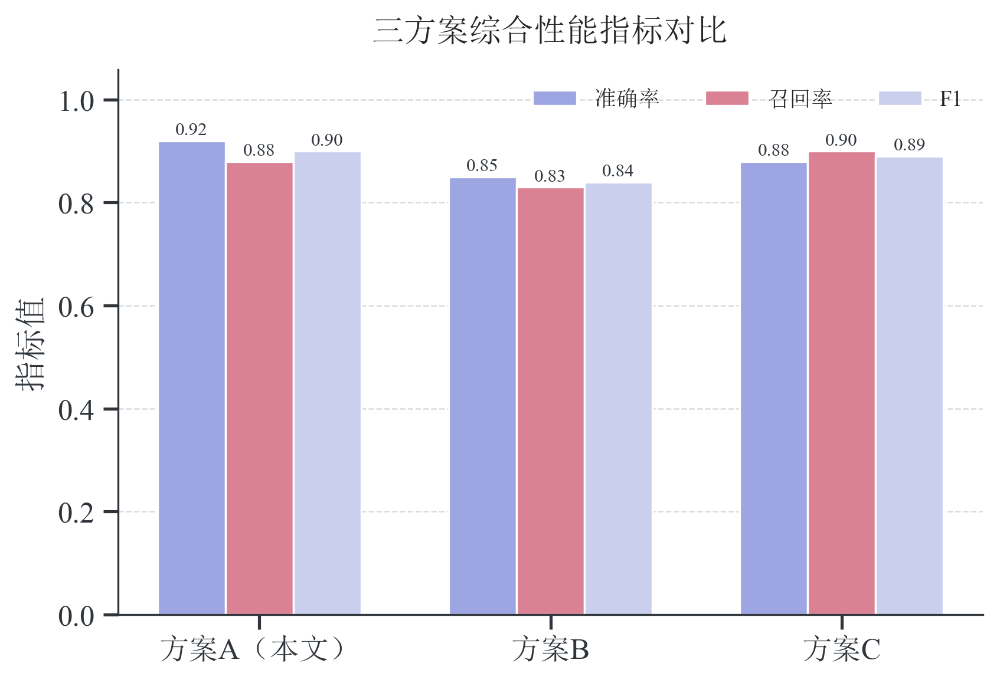
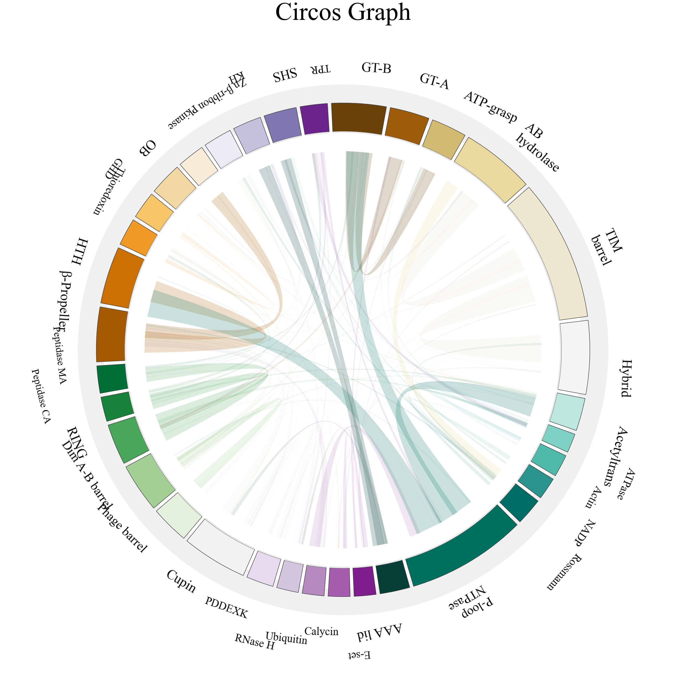
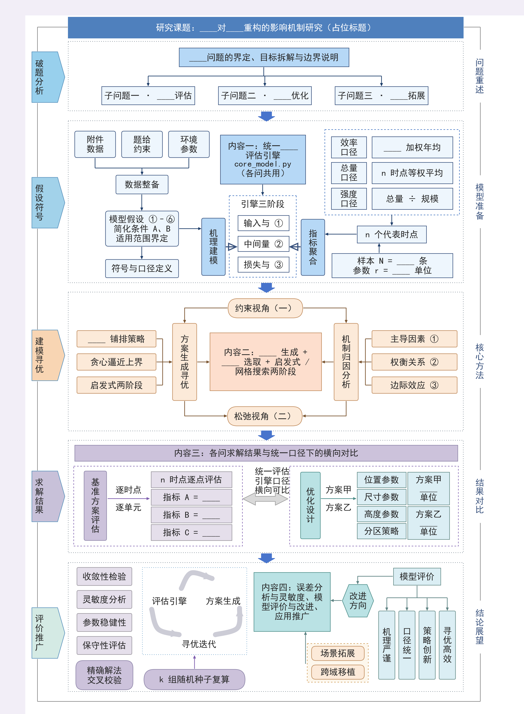
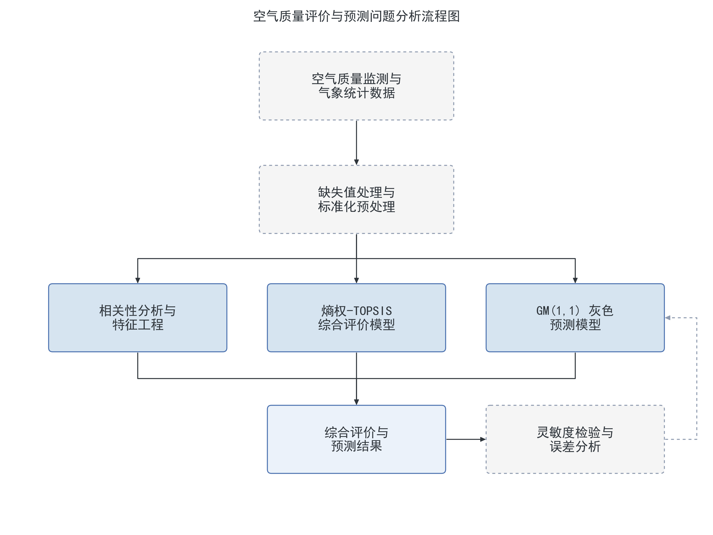
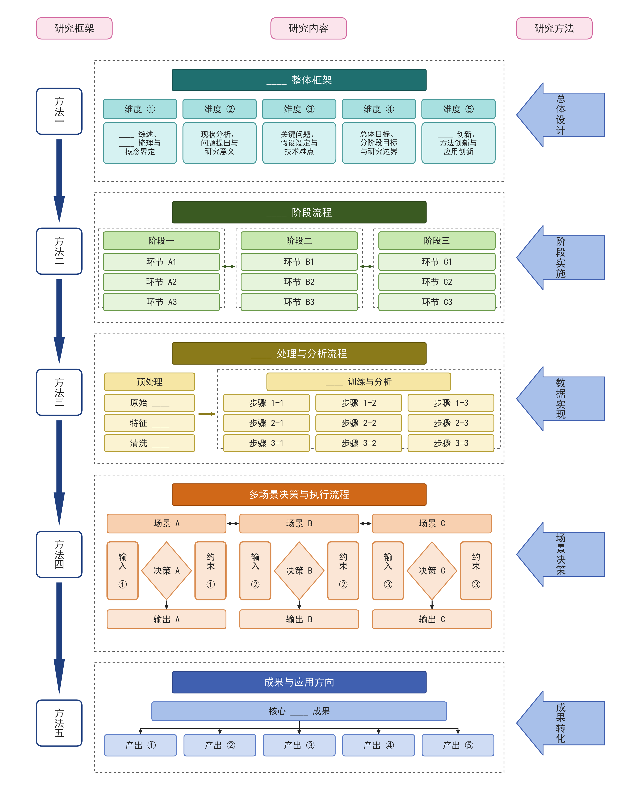

<h1 align="center">mathmodel-kit</h1>

<p align="center">
  A one-stop agent skill kit for mathematical modeling competitions<br>
  Problem analysis · Model building · Algorithm implementation · Publication-grade figures · Paper production & grading
</p>

<p align="center">
  <a href="https://github.com/Escap1ng/mathmodel-kit/actions/workflows/ci.yml"></a>
  <a href="https://github.com/Escap1ng/mathmodel-kit/actions/workflows/paper.yml"></a>
  
  
  
  
  
</p>

<p align="center">
  <a href="README.md">简体中文</a> &nbsp;·&nbsp; <b>English</b>
</p>

---

## Table of contents

[What is this](#what-is-this) · [Skill matrix](#skill-matrix) · [Gallery](#gallery) ·
[Design principles](#design-principles) · [Figure style: Nature standard](#figure-style-nature-standard) ·
[Workflow and quality gates](#workflow-and-quality-gates) · [Quick start](#quick-start) ·
[Repository layout](#repository-layout) · [Dependencies and tested environment](#dependencies-and-tested-environment) ·
[FAQ](#faq) · [Extending and contributing](#extending-and-contributing) ·
[Acknowledgements](#acknowledgements) · [License](#license)

## What is this

`mathmodel-kit` is a set of agent skills for mathematical modeling competitions: four skills, usable
separately or chained together by the orchestrator.

- `math-modeling-helper` (orchestrator) — runs the whole contest in six stages (problem analysis → model
  building → implementation → paper → grading) and ships code rules plus a grading rubric;
- `mathmodel-figure` (data figures) — 20 bundled matplotlib templates; when none fits, draw to the
  [`nature-standard.md`](skills/mathmodel-figure/docs/guides/nature-standard.md) spec instead;
- `mathmodel-diagram` (academic diagrams) — 5 JSON-driven layouts, plus authoring from scratch and
  high-fidelity replication of a reference image;
- `mathmodel-paper` (paper output) — a LaTeX skeleton compiles to PDF, converts to Word, and receives
  contest-style layout fine-tuning.

The division of labour: **the skills own mechanical correctness, the user owns modeling judgment**.
Reproducible data, figures free of clipping and overlap, paper numbers traceable to script output, and
layout passing self-checks are guaranteed by the skills; method choice, result interpretation and novelty
claims stay with the user.

## Skill matrix

| Skill | Role | Entry point | Output |
|---|---|---|---|
| [`math-modeling-helper`](skills/math-modeling-helper/SKILL.md) | Orchestrator: problem analysis, algorithm selection, implementation, writing & grading | Hand it the problem statement or a modeling request | Workspace skeleton, code and results, paper and grading report |
| [`mathmodel-figure`](skills/mathmodel-figure/SKILL.md) | Data figures: 20 matplotlib templates plus a Nature standard for hand-drawn chart types | `python3 code/tools/render_template.py <template-id>` | PNG (300 DPI) + PDF + SVG + an editable script |
| [`mathmodel-diagram`](skills/mathmodel-diagram/SKILL.md) | Academic diagrams: 5 JSON-driven templates, plus authoring from scratch and high-fidelity replication | `python3 code/templates/<template>.py content.json` | PNG (300 DPI) + vector PDF + content JSON |
| [`mathmodel-paper`](skills/mathmodel-paper/SKILL.md) | Paper output: LaTeX skeleton → PDF → Word with contest-layout fine tuning | `xelatex` + `code/word_postprocess.py` | Compliant `.pdf` and `.docx`, abstract template |

## Gallery

Data figures (`mathmodel-figure`)

| Grouped bar (Nature role palette) | Paired raincloud | Nature-style chord diagram |
|---|---|---|
|  |  |  |

Academic diagrams (`mathmodel-diagram`)

| Five-band roadmap | Problem-analysis flow | Three-column stage flow |
|---|---|---|
|  |  |  |

Every preview maps 1:1 to its template script: restyle, re-render, overwrite.

## Design principles

- **End-to-end pipeline** — one entry point spans "understand the problem → build the model → implement → write → grade"; specialists stay independently callable.
- **Publication-grade by default** — 300 DPI, vector-first; palette, type sizes, line weights and axis frames live in one style module, so a single edit propagates everywhere.
- **Not template-bound** — chart type follows the data structure and the claim being argued. Templates accelerate, they do not fence you in; when none fits, draw from scratch to the same standard and the style still matches.
- **Deterministic and reproducible** — templates ship seeded simulation data, diagrams are driven by content JSON, so any artifact can be re-rendered and revised.
- **Machine-checked gates** — overflow exits non-zero, CJK text width is measured slot by slot before drawing, nine-zone inspection and red-team review run before delivery, plus a self-scoring card for the paper.
- **Anti-fabrication** — no invented references or data; simulation results may never be presented as a real paper's numbers; paper figures must trace back to a script output.

## Figure style: Nature standard

Simple data chart types follow a Nature layout — small sans-serif type, thin axes, no redundant legends —
and color follows exactly four rules:

| Job | Value | Rule |
|---|---|---|
| Identity | Hero blue `#1A6FC4`, secondary series orange / purple / teal / coral | The same method keeps the same color in every figure |
| Baseline | Mid grey `#767676` | Controls, means and reference lines are always grey |
| Direction | Green `#2E9E44` / red `#E53935` | Reserved for signed deltas, paired with `↑/↓` so it survives greyscale |
| Hierarchy | Same-hue luminance ramp (dark → light) | Primary evidence is dark, supporting information is light |

The wording of the rules lives in
[`visualization-rules.md`](skills/mathmodel-figure/docs/guides/visualization-rules.md); the path outside the
template library lives in [`nature-standard.md`](skills/mathmodel-figure/docs/guides/nature-standard.md)
(six hard requirements, a runnable starter skeleton, a chart-type selection table, and a cross-figure
consistency contract). Both paths consume the same style constants, so hand-drawn and templated figures sit
side by side without a visible seam.

## Workflow and quality gates

```
Stage 0  Environment pre-check  ── xelatex / python-docx / plotting libraries availability
  ▼
Stage 1  Problem analysis       ── decomposition, sub-question classification
  ▼
Stage 2  Workspace setup        ── code/ results/ figures/ paper/ laid out on disk
  ▼
Stage 3  Algorithm selection    ── candidate comparison and risk probing (reasoning kept internal)
  ▼
Stage 4  Implementation         ── runnable scripts, result summaries, figures at ≥300 DPI
  ▼
Stage 5  Paper production       ── LaTeX draft → PDF → Word, figures placed next to the text they support
  ▼
Stage 6  Grading and revision   ── self-scoring card plus consistency audit; no pass, no delivery
```

## Quick start

**1. Install a skill** — copy the skill directory you need into your agent's skill folder (Claude Code shown):

```bash
cp -r skills/mathmodel-figure ~/.claude/skills/
```

Then just ask, e.g. "compare the runtime distribution of three experiments with a raincloud plot", or
"redraw this reference image as a technical roadmap".

**2. Data figures**

```bash
cd skills/mathmodel-figure
python3 code/tools/render_template.py --list             # all 20 template ids
python3 code/tools/render_template.py paired-raincloud   # accepts id / English alias / Chinese title
python3 code/tools/render_template.py 模块占比环形图        # Chinese titles resolve too
```

Artifacts land in `绘图复刻/outputs/` (PNG/PDF/SVG) and the editable copy in `绘图复刻/scripts/`; customize the
copy, never the bundled template. When no template matches, start from `docs/guides/nature-standard.md` —
still `from plot_style import ...`, so the style stays identical.

**3. Academic diagrams**

```bash
cd skills/mathmodel-diagram
python3 code/templates/roadmap_5band.py content.json -o out.png   # PNG 300dpi + matching vector PDF
python3 code/templates/roadmap_5band.py content.json --check      # capacity check only, writes nothing
```

Three routes: use one of the 5 built-in layouts, author from scratch (algorithm / architecture / mechanism
schematics), or replicate a reference image at high fidelity.

**4. Paper** — copy `skills/mathmodel-paper/templates/paper.tex` into your workspace and fill the
placeholders, compile twice with `xelatex` for the PDF, convert to Word with `pandoc`, then fine-tune the
layout with `code/word_postprocess.py`; the abstract guide and its checks are in
`templates/abstract-template.md`.

## Repository layout

```
mathmodel-kit/
├── README.md                       # Chinese docs (this file: README_EN.md)
├── README_EN.md                    # English docs
├── LICENSE                         # Apache License 2.0
└── skills/
    ├── math-modeling-helper/       # Orchestrator: stage 0-6 workflow, code & paper rules, grading card
    │   └── SKILL.md
    ├── mathmodel-figure/           # Data figure skill
    │   ├── code/style/             #   plot_style.py: palette, type scale, sizes, style helpers
    │   ├── code/templates/         #   20 chart templates with deterministic simulation data
    │   ├── code/tools/             #   render_template.py: id / alias / Chinese title → copy & render
    │   ├── docs/guides/            #   visualization rules, Nature standard, customization recipes
    │   └── examples/previews/      #   20 previews named after their templates
    ├── mathmodel-diagram/          # Academic diagram skill
    │   ├── code/common.py          #   drawing primitives and capacity checks
    │   ├── code/templates/         #   5 JSON-driven layouts
    │   ├── docs/guides/            #   methodology: authoring / replication / self-check
    │   └── examples/               #   reproducible samples (content.json + preview.png)
    └── mathmodel-paper/            # Paper output skill
        ├── templates/              #   paper.tex skeleton, abstract template
        └── code/                   #   word_postprocess.py: Word layout post-processing
```

## Dependencies and tested environment

| Purpose | Requirements |
|---|---|
| Data figures | Python 3 with `matplotlib` / `seaborn` / `numpy` / `pandas` |
| Academic diagrams | `matplotlib` + `numpy`; the calibration scripts of the replication route also need `scipy` / `Pillow` |
| Paper compilation | `xelatex` (with CJK font support) + `pandoc` |
| Word fine tuning | `python-docx` |
| Reading contest attachments | `openpyxl` (`xlrd` for legacy `.xls`), `PyMuPDF` |

Tested on Python 3.14 with matplotlib 3.10 and seaborn 0.13 (Windows). On Linux/macOS without a CJK font the
style module warns and falls back, and Chinese labels may render as boxes — install `Noto Sans CJK SC`.

## FAQ

| Symptom | Fix |
|---|---|
| Chinese labels show as boxes | The environment lacks a CJK font; install Microsoft YaHei / SimHei / Noto Sans CJK and re-render (`plot_style` warns loudly instead of failing silently) |
| Chinese boxes only where a formula appears in the label | Never mix mathtext with CJK: `"问题规模 $n$（个）"` → plain `"问题规模 n（个）"` |
| Groups indistinguishable in greyscale print | Luminance ramp plus redundant line/marker encoding and direct labels; red/green only ever appears on signed `↑/↓` deltas |
| Want to rebrand the whole figure set | Edit `code/style/plot_style.py` once — all 20 templates and every hand-drawn figure follow |
| Renderer says unknown template | Run `--list`, or pass an English alias / a fragment of the Chinese chart title |

## Extending and contributing

- New data figure template: follow the delivery checklist in
  [`mathmodel-figure/README.md`](skills/mathmodel-figure/README.md) — template script, catalog row, 1:1
  preview, renderer registration, SKILL list entry;
- New diagram layout: see [`authoring.md`](skills/mathmodel-diagram/docs/guides/authoring.md); geometry
  constants must be calibrated slot by slot, and `--check` plus the nine-zone inspection must pass first;
- Please attach the minimal reproducible command and a rendered screenshot so style consistency can be
  reviewed at a glance.

## Acknowledgements

The Nature color-role split and the "inspect the rendered output, not just the code" discipline for data
figures were informed by the `math-figure-generator` skill in the community repository
[MathModeling-skills](https://github.com/zhnnky329/MathModeling-skills).

## License

[Apache License 2.0](LICENSE)
